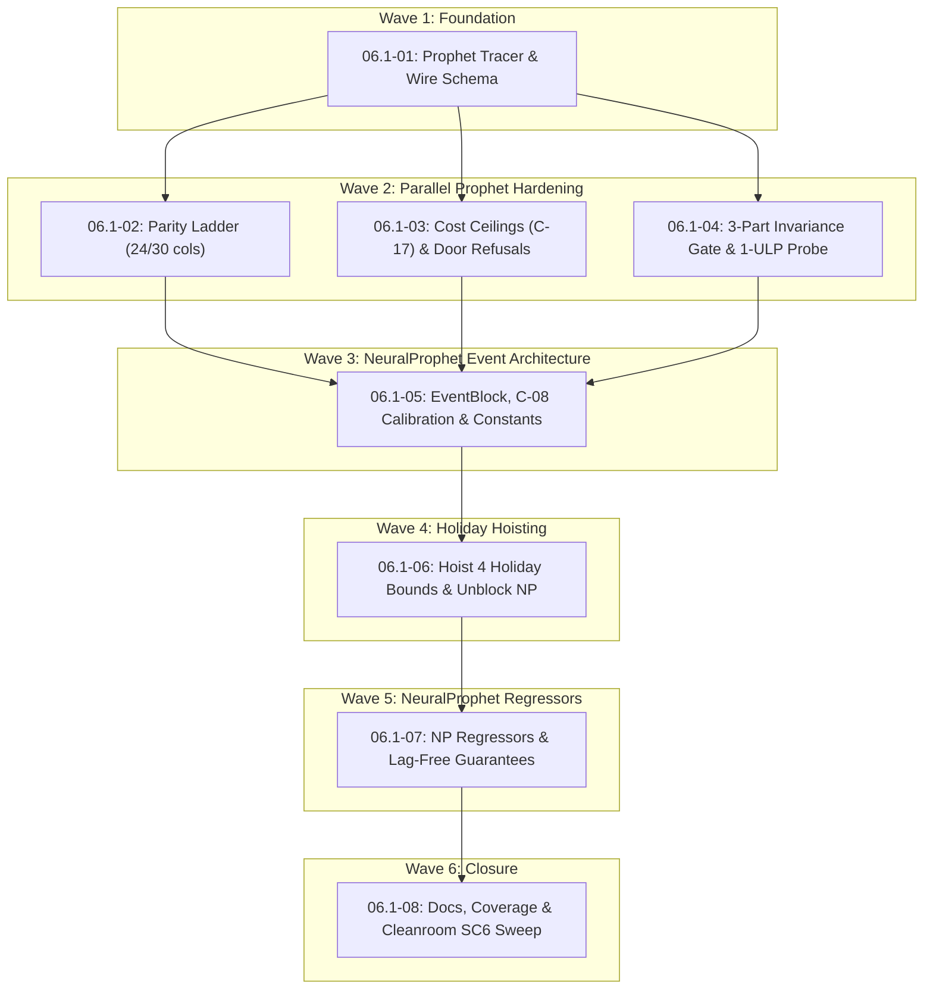

# Cross-AI Plan Review — Phase 06.1

<!-- gsd:plan-revision-conflicts:begin -->
## Plan-Revision Conflicts
<!-- gsd:plan-revision-conflicts:end -->

## Codex Review

Reviewed all eight plans against the repository source, contracts, fixtures, spike implementations, and CI configuration. I also ran focused checks of two verification scripts and fixture arithmetic. I did not modify files or run the full workspace suite.

## 06.1-01

**Summary:** The additive splice and pre-change baseline are sound foundations. The plan needs corrections to numerical validation, baseline provenance, and Rust call-site coverage before execution.

**Strengths**

- The existing `Design` exposes the matrix, column metadata, masks, and priors needed for an additive extension; the objective already consumes those arrays generically. This supports retaining the optimizer unchanged. Evidence: `crates/aprender-forecast/src/prophet.rs:225`, `crates/aprender-forecast/src/prophet.rs:526`.
- Adding `RegressorArg` to the schema-owner enumeration is necessary: the existing test derives properties separately for each explicitly listed owner, then checks set equality. Evidence: `crates/aprender-forecast/src/types.rs:566`, `crates/aprender-forecast/src/types.rs:611`.

**Concerns**

- **HIGH — The numerical acceptance boundary is unsafe.** The plan explicitly accepts the smallest positive normal `prior_scale`. The existing objective and gradient square that value, underflowing the denominator to zero; initial zero coefficients then encounter `0/0`. Likewise, finite input values can overflow the proposed mean/variance calculation, and checking only `std == 0` will miss non-finite derived values. Evidence: `.planning/phases/06.1-forecast-exogenous-inputs-prophet-regressors-neuralprophet-e/06.1-01-PLAN.md:536`; `crates/aprender-forecast/src/prophet.rs:536`; `crates/aprender-forecast/src/prophet.rs:685`; `.claude/skills/spike-findings-aprender/sources/011-prophet-regressor-parity/src/regressors.rs:55`.
- **MEDIUM — The provenance check does not establish valid ancestry.** It accepts empty stdout from `git show` without checking whether the revision exists. I reproduced acceptance with an invalid revision returning exit 128. Capture also records HEAD *before* commit A, while later plans treat that recorded SHA as commit A and take its parent, introducing an off-by-one base. Evidence: `.planning/phases/06.1-forecast-exogenous-inputs-prophet-regressors-neuralprophet-e/06.1-01-PLAN.md:269`, `.planning/phases/06.1-forecast-exogenous-inputs-prophet-regressors-neuralprophet-e/06.1-01-PLAN.md:452`; `.planning/phases/06.1-forecast-exogenous-inputs-prophet-regressors-neuralprophet-e/06.1-08-PLAN.md:219`.
- **MEDIUM — Optional JSON fields still break exhaustive Rust struct literals.** The plan identifies the doctest but misses the server binary’s `ForecastArgs` literal, outside its declared files. Adding `regressors` requires updating this caller for the mandated all-targets check to compile. Evidence: `.planning/phases/06.1-forecast-exogenous-inputs-prophet-regressors-neuralprophet-e/06.1-01-PLAN.md:297`; `crates/aprender-mcp-forecast/src/main.rs:71`.

**Suggestions**

- Define numerically usable prior bounds and validate standardized history/future values after arithmetic.
- Store an explicit `phase_base_commit`; validate revision existence and ancestry separately from file absence.
- Enumerate every exhaustive `ForecastArgs` construction and changed `predict` call, including binaries and examples.
- Resolve the constant-binary contradiction: the prototype’s auto exemption requires **both** zero and one, whereas the planned positive control expects a zero-spread binary column to be exempt.

**Risk Assessment: HIGH.** Accepted inputs can produce invalid arithmetic, and the provenance gate currently admits invalid evidence.

## 06.1-02

**Summary:** The rung-by-rung parity structure is appropriate, but the exact-zero matrix requirement contradicts the committed experiment it is intended to preserve.

**Strengths**

- Separate preprocessing, prediction, component, and fitted-objective tests follow the existing ladder’s diagnostic structure. Evidence: `crates/aprender-forecast/src/prophet.rs:1276`.
- The one-sided objective comparison correctly accommodates different coefficients on a flat optimum. The spike records a better Rust objective despite coefficient disagreement, and `FitInfo.objective` is already unscaled. Evidence: `.claude/skills/spike-findings-aprender/sources/011-prophet-regressor-parity/RUN-OUTPUT.md:56`; `crates/aprender-forecast/src/fit.rs:125`.

**Concerns**

- **HIGH — The planned matrix assertion rejects the validated implementation.** Task 2 requires `X_first3` and `X_last3` to match at exactly zero. The committed spike reports a maximum difference of `3.33e-15` at both widths. This is distinct from the exact masks and prior scales. A focused calculation over the committed fixture also reproduced a nonzero standardized weather-cell difference. Evidence: `.planning/phases/06.1-forecast-exogenous-inputs-prophet-regressors-neuralprophet-e/06.1-02-PLAN.md:272`; `.claude/skills/spike-findings-aprender/sources/011-prophet-regressor-parity/RUN-OUTPUT.md:24`; `.claude/skills/spike-findings-aprender/sources/011-prophet-regressor-parity/RUN-OUTPUT.md:88`.
- **MEDIUM — The tolerance-literal guard omits the tightest new tolerance.** The regex detects `1e-14` but not `1e-15`, allowing the regressor prediction threshold to become hardcoded while the gate remains green. Evidence: `.planning/phases/06.1-forecast-exogenous-inputs-prophet-regressors-neuralprophet-e/06.1-02-PLAN.md:382`. The intended contract-reader discipline is documented at `crates/aprender-forecast/src/prophet.rs:1287`.

**Suggestions**

- Give matrix arithmetic its own measured tolerance; retain exact equality for names, masks, and prior scales.
- Extend the literal guard and its positive controls to include `1e-15`.
- Assert the complete expected component-key set before comparing values, rather than relying on intersection and minimum counts.

**Risk Assessment: HIGH.** The principal acceptance test is inconsistent with known-good evidence and will block a faithful implementation.

## 06.1-03

**Summary:** Count/product bounds and conditional diagnostics address real risks. Reserved names, diagnostic numerical behavior, and measurement ordering remain insufficiently specified.

**Strengths**

- Bounding names before echoing them follows the existing holiday guard’s amplification and error-message protections. Evidence: `crates/aprender-forecast/src/forecast.rs:193`.
- Conditional insertion into `diagnostics` is compatible with the existing response construction and the signature’s whole-object hashing. Evidence: `crates/aprender-forecast/src/forecast.rs:395`; `.claude/skills/spike-findings-aprender/sources/012-no-arg-bitwise-invariance/src/sig.rs:97`.

**Concerns**

- **HIGH — The collision checks miss reserved aggregate keys.** Generated column names and column component names do not include every response key. A regressor named `additive_terms`, `multiplicative_terms`, or an `extra_regressors_*` roll-up can still collide with an aggregate. The forecast assembly inserts duplicate names into a map, overwriting earlier values. Evidence: `.planning/phases/06.1-forecast-exogenous-inputs-prophet-regressors-neuralprophet-e/06.1-03-PLAN.md:177`; `crates/aprender-forecast/src/prophet.rs:872`; `crates/aprender-forecast/src/forecast.rs:380`.
- **HIGH — Cost calibration precedes the expensive feature being bounded.** Task 1 derives ceilings before Task 2 implements the diagnostic, although C-17 explicitly includes `N*K² + K³`. A fixed feature-cell product does not fix either diagnostic term. The existing sweep times the currently implemented public door, so an early measurement excludes the future diagnostic. Evidence: `.planning/phases/06.1-forecast-exogenous-inputs-prophet-regressors-neuralprophet-e/06.1-03-PLAN.md:129`, `.planning/phases/06.1-forecast-exogenous-inputs-prophet-regressors-neuralprophet-e/06.1-03-PLAN.md:146`; `crates/aprender-forecast/src/sc1_wall.rs:340`.
- **MEDIUM — Singular diagnostics lack a defined reporting policy.** A ridge changes the inverse and eigenvalues being reported. The plan does not define ridge size, escalation, exhausted-factorization behavior, nonconvergence, or whether reported values describe the original or regularized matrix. Its output shape is also contradictory: an array cannot itself carry a `scope` property, and a numeric condition number cannot itself carry a warning string. Evidence: `.planning/phases/06.1-forecast-exogenous-inputs-prophet-regressors-neuralprophet-e/06.1-03-PLAN.md:283`, `.planning/phases/06.1-forecast-exogenous-inputs-prophet-regressors-neuralprophet-e/06.1-03-PLAN.md:323`. The production envelope permits arbitrary JSON, so these contradictions will not be caught by a typed report schema: `crates/aprender-forecast/src/types.rs:335`.
- **MEDIUM — One specified positive case is unavailable in this wave.** The plan expects a successful NP request carrying holidays, but the existing door still refuses that combination until plan 06. Evidence: `.planning/phases/06.1-forecast-exogenous-inputs-prophet-regressors-neuralprophet-e/06.1-03-PLAN.md:264`; `crates/aprender-forecast/src/forecast.rs:122`.

**Suggestions**

- Reserve every emitted aggregate/component key explicitly.
- Finalize ceilings after implementing diagnostics; include maximum-width and combined holiday/regressor cases.
- Define a typed diagnostic report with explicit singular/regularized/nonconverged states and bounded numerical routines.
- Use an NP request without holidays here; add the holiday-specific assertion in plan 06.

**Risk Assessment: HIGH.** The current plan can silently overwrite components and certify a ceiling against incomplete work.

## 06.1-04

**Summary:** Mutation testing and inclusion of uncertainty bands substantially improve the gate. The claimed independence of part C and the wall-clock diagnosis need narrowing.

**Strengths**

- ULP mutations are well matched to the existing bit-based signature, which explicitly hashes both uncertainty arrays. Evidence: `.claude/skills/spike-findings-aprender/sources/012-no-arg-bitwise-invariance/src/sig.rs:22`, `.claude/skills/spike-findings-aprender/sources/012-no-arg-bitwise-invariance/src/sig.rs:88`.
- Comparing bands is necessary: prediction uncertainty directly uses additive and multiplicative feature contributions. Evidence: `crates/aprender-forecast/src/prophet.rs:969`.

**Concerns**

- **MEDIUM — Part C is a no-op splice comparison, not an independent pre-change prediction comparison.** Both sides call the same modified `predict`, so a common regression in its empty-channel branch affects both equally. The committed baseline provides the independent historical evidence; part C cannot substitute for it. Evidence: `.planning/phases/06.1-forecast-exogenous-inputs-prophet-regressors-neuralprophet-e/06.1-04-PLAN.md:277`; `.planning/phases/06.1-forecast-exogenous-inputs-prophet-regressors-neuralprophet-e/06.1-01-PLAN.md:349`; `crates/aprender-forecast/src/prophet.rs:813`.
- **MEDIUM — Masking `budget_hit` cannot reliably isolate environment-induced differences.** The budget check breaks the optimization loop, changing parameters, iteration counts, objective, predictions, and bands—not merely the flag. Independently fitting both part-C designs adds that variability to a mechanism test. Evidence: `.planning/phases/06.1-forecast-exogenous-inputs-prophet-regressors-neuralprophet-e/06.1-04-PLAN.md:123`; `crates/aprender-forecast/src/fit.rs:104`, `crates/aprender-forecast/src/fit.rs:112`.

**Suggestions**

- Describe part C precisely as empty-splice identity; retain the pre-change baseline as the historical comparison.
- Use identical fixed parameters for part C to isolate design/prediction behavior.
- Report complete fit diagnostics on mismatches and establish baseline reproducibility on the CI target.
- Add direct mutations of both bands and diagnostics so their inclusion is independently tested.

**Risk Assessment: MEDIUM.** The gate structure is useful, but its current explanations overstate what individual checks establish.

## 06.1-05

**Summary:** Composing an event block beside `NpModel` is supported by the spike. The plan has a compile-order contradiction and does not yet define a dimensionally valid cost calibration.

**Strengths**

- The prototype demonstrates one optimizer over both parameter sets and graph clearing after each step. Evidence: `.claude/skills/spike-findings-aprender/sources/013-np-events-autograd/src/main.rs:99`, `.claude/skills/spike-findings-aprender/sources/013-np-events-autograd/src/main.rs:134`.
- Keeping holiday acceptance closed until bounds are ready is sound; the existing refusal is explicit and precedes dispatch. Evidence: `crates/aprender-forecast/src/forecast.rs:117`.

**Concerns**

- **HIGH — Task 1 cannot satisfy its API changes while leaving `forecast.rs` untouched.** Adding fields to `TrainConfig` and changing prediction interfaces requires updating the door’s exhaustive config literal and callers. The plan explicitly prohibits those edits. Task 2 also changes `request_train_cost` and requests edits to forecast tests without listing `forecast.rs` among its files. Evidence: `.planning/phases/06.1-forecast-exogenous-inputs-prophet-regressors-neuralprophet-e/06.1-05-PLAN.md:214`, `.planning/phases/06.1-forecast-exogenous-inputs-prophet-regressors-neuralprophet-e/06.1-05-PLAN.md:252`, `.planning/phases/06.1-forecast-exogenous-inputs-prophet-regressors-neuralprophet-e/06.1-05-PLAN.md:405`; `crates/aprender-forecast/src/forecast.rs:475`, `crates/aprender-forecast/src/forecast.rs:503`.
- **HIGH — Microseconds per step are not the existing training-cost units.** The current price is an integer proxy, `epochs * samples * (lags + 1)`, multiplied by sweep width. The proposed coefficient is a measured microsecond slope, but no conversion specifies batch size, step count, sample count, or sweep accounting. Directly comparing that price with measured time is not meaningful. The spike’s reported ratio is time relative to events-OFF, not time divided by proxy units. Evidence: `.planning/phases/06.1-forecast-exogenous-inputs-prophet-regressors-neuralprophet-e/06.1-05-PLAN.md:340`, `.planning/phases/06.1-forecast-exogenous-inputs-prophet-regressors-neuralprophet-e/06.1-05-PLAN.md:399`; `crates/aprender-forecast/src/np.rs:445`, `crates/aprender-forecast/src/np.rs:508`; `.claude/skills/spike-findings-aprender/sources/013-np-events-autograd/src/main.rs:280`.
- **HIGH — The provisional override does not satisfy the stated target-measurement criterion.** The checkpoint allows an aarch64 coefficient to pass with a recorded ruling, while the plan’s success criteria still claim target-host measurement. Provenance makes the exception visible; it does not establish the required measurement. Evidence: `.planning/phases/06.1-forecast-exogenous-inputs-prophet-regressors-neuralprophet-e/06.1-05-PLAN.md:533`; `.github/workflows/ci.yml:96` identifies the X64 target.

**Suggestions**

- Permit mechanical caller updates while retaining the holiday refusal.
- Specify the complete cost equation and coefficient units, then calibrate across batch sizes, lag settings, and request geometries.
- Commit the calibration observations consumed by the closure test.
- Treat provisional acceptance as an explicit SC4 amendment or an open requirement, not equivalent evidence.

**Risk Assessment: HIGH.** Both executable ordering and the phase’s central cost-safety claim require revision.

## 06.1-06

**Summary:** Bounds-before-acceptance sequencing is appropriate. Component scaling and public-door recovery tests are missing, and the automated hoist check is demonstrably ineffective.

**Strengths**

- The operand-aware hoist addresses the actual allocation geometry: NP materializes every day between the first and last observations, while the current holiday bound counts caller rows. Evidence: `crates/aprender-forecast/src/np.rs:172`; `crates/aprender-forecast/src/forecast.rs:302`.
- Replacing the refusal with a positive test and an events-OFF control tests more than successful deserialization. The server delegates directly to the library door, making wire-level cases meaningful. Evidence: `crates/aprender-mcp-forecast/src/lib.rs:60`.

**Concerns**

- **HIGH — Event components omit conversion back to response units.** The plan specifies learned weight times indicator. Event weights train in normalized target units; the prototype multiplies them by `d.scale` before comparing with the planted effect. Publishing raw contributions would disagree with Prophet’s original-unit additive components. Evidence: `.planning/phases/06.1-forecast-exogenous-inputs-prophet-regressors-neuralprophet-e/06.1-06-PLAN.md:296`; `crates/aprender-forecast/src/np.rs:250`; `.claude/skills/spike-findings-aprender/sources/013-np-events-autograd/src/main.rs:227`.
- **HIGH — Public-door recovery and determinism are promised but not assigned.** The listed e2e cases check component presence, changed forecasts, and refusals; none measures per-column recovery or repeated-seed behavior. This matters because the door uses a specific AR architecture, weight decay, epoch rule, and learning-rate selection. Evidence: `.planning/phases/06.1-forecast-exogenous-inputs-prophet-regressors-neuralprophet-e/06.1-06-PLAN.md:35`, `.planning/phases/06.1-forecast-exogenous-inputs-prophet-regressors-neuralprophet-e/06.1-06-PLAN.md:425`; `crates/aprender-forecast/src/forecast.rs:477`.
- **MEDIUM — The hoist-position gate passes the unhoisted source.** Its first occurrence of `MAX_HOLIDAY_NAME_LEN` is the import, not the guard. I ran the predicate against the current tree: it returned true although the actual check remains inside the Prophet arm. Evidence: `.planning/phases/06.1-forecast-exogenous-inputs-prophet-regressors-neuralprophet-e/06.1-06-PLAN.md:183`; `crates/aprender-forecast/src/forecast.rs:24`, `crates/aprender-forecast/src/forecast.rs:208`.

**Suggestions**

- Publish additive event components as `scale * Σ(weight * indicator)`, without adding the target shift to each component.
- Add public-door recovery and determinism tests at zero and nonzero lags using the production training configuration.
- Replace the import-sensitive source check with a structural check, and retain the proposed behavioral mutations.

**Risk Assessment: HIGH.** The door could return incorrectly scaled components while all currently assigned e2e tests pass.

## 06.1-07

**Summary:** Caller-row indexing is the right structural solution for lag-free gaps. The plan does not yet complete validation, training-cost accounting, or the semantics of every accepted regressor field.

**Strengths**

- Caller-row indexing aligns with the existing lag-free sample list, which excludes imputed rows. Evidence: `crates/aprender-forecast/src/np.rs:597`.
- The four-case gap predicate test distinguishes the two required conjuncts. Existing strict date ordering and inclusive span computation support an exact missing-day count. Evidence: `crates/aprender-forecast/src/forecast.rs:72`, `crates/aprender-forecast/src/forecast.rs:80`.

**Concerns**

- **HIGH — Shared regressor validation is never moved onto the NP path.** Plan 01 deliberately places length, finiteness, mode, prior, duplicate, and spread checks inside the Prophet arm; plan 03 adds ceilings there. Plan 07 removes the NP refusal and adds only multiplicative/gap rules. It contains no explicit extraction or invocation of those earlier guards. Evidence: `.planning/phases/06.1-forecast-exogenous-inputs-prophet-regressors-neuralprophet-e/06.1-01-PLAN.md:501`; `.planning/phases/06.1-forecast-exogenous-inputs-prophet-regressors-neuralprophet-e/06.1-03-PLAN.md:165`; `.planning/phases/06.1-forecast-exogenous-inputs-prophet-regressors-neuralprophet-e/06.1-07-PLAN.md:217`. The actual model dispatch separates these execution paths: `crates/aprender-forecast/src/forecast.rs:132`.
- **HIGH — Numeric regressors add repeated training work without a pricing task.** The plan claims the regressor design-cell ceiling bounds the remaining cost, but that ceiling has no epoch or learning-rate-sweep factor. The existing training loop revisits feature inputs every batch and epoch; plan 05 prices event columns only. Evidence: `.planning/phases/06.1-forecast-exogenous-inputs-prophet-regressors-neuralprophet-e/06.1-07-PLAN.md:405`; `crates/aprender-forecast/src/np.rs:634`; `.planning/phases/06.1-forecast-exogenous-inputs-prophet-regressors-neuralprophet-e/06.1-05-PLAN.md:339`.
- **HIGH — The learned regressor block and `prior_scale` semantics are underspecified.** Task 1 describes indexing and adding contributions, but does not specify parameter registration, optimizer participation, fitted-state ownership, or how `prior_scale` affects NP training. The existing trainer has one global AdamW decay, not a per-regressor prior. Accepting that field without implementing or refusing its effect violates the stated no-silent-ignore rule. Evidence: `.planning/phases/06.1-forecast-exogenous-inputs-prophet-regressors-neuralprophet-e/06.1-07-PLAN.md:119`, `.planning/phases/06.1-forecast-exogenous-inputs-prophet-regressors-neuralprophet-e/06.1-07-PLAN.md:144`; `crates/aprender-forecast/src/np.rs:616`.
- **MEDIUM — The four-rule probe needs an executable injection mechanism.** After removing imputed-day slots, four different *notional* fills can become four identical calls. Historical sensitivity at seven lags does not prove the new test can detect a production indexing regression. Evidence: `.planning/phases/06.1-forecast-exogenous-inputs-prophet-regressors-neuralprophet-e/06.1-07-PLAN.md:326`; `.claude/skills/spike-findings-aprender/sources/014-np-gap-imputation-regressors/src/main.rs:251`.

**Suggestions**

- Extract shared validation and re-mutate its guards on NP before removing the temporary refusal.
- Include numeric-regressor width in calibrated training cost, including combined events-plus-regressors requests.
- Specify the learned block, optimizer ownership, retained inference state, and prior semantics.
- Add a planted numeric-driver effect test and an observed mutation proving the caller-row probe detects incorrect indexing.

**Risk Assessment: HIGH.** This plan can reopen the same validation and underpricing defects the phase is intended to close.

## 06.1-08

**Summary:** Documentation and a clean-checkout build are useful closing work. The plan confuses schema-property descriptions with the MCP tool description and does not fully prove its consumer compatibility claim.

**Strengths**

- The proposed workspace nextest command matches the main CI invocation and its exclusions. Evidence: `.github/workflows/ci.yml:289`.
- A detached-checkout `--locked` build meaningfully checks that committed dependencies and files suffice, provided it targets the same finalized revision as the other gates. Evidence: `.planning/phases/06.1-forecast-exogenous-inputs-prophet-regressors-neuralprophet-e/06.1-08-PLAN.md:370`.

**Concerns**

- **MEDIUM — Updating field doc comments does not update `TOOL_DESCRIPTION`.** Schemars supplies the input schema, but the server explicitly passes a separate constant as the tool description. The plan edits only field comments and excludes the server source from its file list. Evidence: `.planning/phases/06.1-forecast-exogenous-inputs-prophet-regressors-neuralprophet-e/06.1-08-PLAN.md:127`; `crates/aprender-mcp-forecast/src/lib.rs:26`, `crates/aprender-mcp-forecast/src/lib.rs:58`.
- **HIGH — The one-line Rust consumer bump is not established.** Adding a public struct field breaks existing exhaustive `ForecastArgs` literals; changing public `prophet::predict` breaks its callers. The clean workspace build only proves callers updated inside this repository compile. The existing server literal demonstrates the compatibility problem concretely. Evidence: `.planning/phases/06.1-forecast-exogenous-inputs-prophet-regressors-neuralprophet-e/06.1-08-PLAN.md:30`; `crates/aprender-mcp-forecast/src/main.rs:71`; `crates/aprender-forecast/src/prophet.rs:813`.
- **MEDIUM — The sweep can test different trees and omits executable gate steps.** Earlier commands test the working tree, whereas the detached build checks HEAD, without a clean-tree precondition. The automated block also omits the separately requested SIMD run and `pv lint contracts/`. CI has a distinct SIMD step. Evidence: `.planning/phases/06.1-forecast-exogenous-inputs-prophet-regressors-neuralprophet-e/06.1-08-PLAN.md:314`, `.planning/phases/06.1-forecast-exogenous-inputs-prophet-regressors-neuralprophet-e/06.1-08-PLAN.md:358`, `.planning/phases/06.1-forecast-exogenous-inputs-prophet-regressors-neuralprophet-e/06.1-08-PLAN.md:370`; `.github/workflows/ci.yml:431`.

**Suggestions**

- Update and test the actual `tools/list` description as well as schema-property descriptions.
- Compile an unchanged representative consumer against the candidate revision, or explicitly narrow the compatibility promise to JSON callers.
- Run all gates against one committed SHA; add explicit SIMD and contract-lint commands.
- Correct the baseline-parent fallback described under plan 01, and keep the release-tag obligation visibly open until shipping.

**Risk Assessment: HIGH.** The planned sweep can pass without proving the advertised downstream upgrade.

## Cross-plan assessment

**Overall risk: HIGH — revise before execution.**

The architecture is mostly supported by source and spike evidence. The major gaps are in connecting that architecture to enforceable acceptance criteria:

1. Correct the impossible exact-matrix assertion and unsafe numerical boundary.
2. Define dimensionally consistent pricing for **both events and numeric regressors**.
3. Make NP inherit all shared validation before opening its regressor surface.
4. Resolve API-change ordering and component scaling.
5. Replace the two verification checks demonstrated to accept invalid evidence.
6. Verify one finalized commit through the actual public door and a representative consumer.

All **8 of 8** manifested plans are covered above.

---

## Gemini Review

# Cross-AI Plan Review: Phase 06.1 Forecast Exogenous Inputs

**Review Target:** Phase 06.1 ("Forecast exogenous inputs: Prophet regressors, NeuralProphet events, and tier-safe cost bounds")  
**Repository:** [`/Users/guy/Development/machine-learning/aprender`](file:///Users/guy/Development/machine-learning/aprender) (Branch: `gsd/phase-2-contract-gate`)  
**Plan Directory:** [`.planning/phases/06.1-forecast-exogenous-inputs-prophet-regressors-neuralprophet-e/`](file:///Users/guy/Development/machine-learning/aprender/.planning/phases/06.1-forecast-exogenous-inputs-prophet-regressors-neuralprophet-e)  

---

### Plan Coverage Manifest

The review manifest contains exactly 8 plans across 6 waves. All 8 plans have been verified against source files in `crates/aprender-forecast`, `crates/aprender-mcp-forecast`, and `contracts/`:

| Plan ID | Wave | Title / Focus | Plan File |
| :--- | :--- | :--- | :--- |
| **06.1-01** | Wave 1 | Tracer: Prophet external regressors tracer & 24-col oracle | [`06.1-01-PLAN.md`](file:///Users/guy/Development/machine-learning/aprender/.planning/phases/06.1-forecast-exogenous-inputs-prophet-regressors-neuralprophet-e/06.1-01-PLAN.md) |
| **06.1-02** | Wave 2 | Regressor parity ladder (24 & 30 cols) & contract rungs | [`06.1-02-PLAN.md`](file:///Users/guy/Development/machine-learning/aprender/.planning/phases/06.1-forecast-exogenous-inputs-prophet-regressors-neuralprophet-e/06.1-02-PLAN.md) |
| **06.1-03** | Wave 2 | Cost ceilings C-17, 4 door refusals, VIF & condition diagnostics | [`06.1-03-PLAN.md`](file:///Users/guy/Development/machine-learning/aprender/.planning/phases/06.1-forecast-exogenous-inputs-prophet-regressors-neuralprophet-e/06.1-03-PLAN.md) |
| **06.1-04** | Wave 2 | 3-part invariance gate, 1-ULP mutation probe, Part C bypass test | [`06.1-04-PLAN.md`](file:///Users/guy/Development/machine-learning/aprender/.planning/phases/06.1-forecast-exogenous-inputs-prophet-regressors-neuralprophet-e/06.1-04-PLAN.md) |
| **06.1-05** | Wave 3 | NeuralProphet event block, C-08 calibration, sibling constants | [`06.1-05-PLAN.md`](file:///Users/guy/Development/machine-learning/aprender/.planning/phases/06.1-forecast-exogenous-inputs-prophet-regressors-neuralprophet-e/06.1-05-PLAN.md) |
| **06.1-06** | Wave 4 | Hoisting holiday bounds, operand-aware design cost, MCP e2e | [`06.1-06-PLAN.md`](file:///Users/guy/Development/machine-learning/aprender/.planning/phases/06.1-forecast-exogenous-inputs-prophet-regressors-neuralprophet-e/06.1-06-PLAN.md) |
| **06.1-07** | Wave 5 | NeuralProphet regressors, lag-free by-construction, gappy refusal | [`06.1-07-PLAN.md`](file:///Users/guy/Development/machine-learning/aprender/.planning/phases/06.1-forecast-exogenous-inputs-prophet-regressors-neuralprophet-e/06.1-07-PLAN.md) |
| **06.1-08** | Wave 6 | Documentation, AR caution, coverage declarations, SC6 sweep | [`06.1-08-PLAN.md`](file:///Users/guy/Development/machine-learning/aprender/.planning/phases/06.1-forecast-exogenous-inputs-prophet-regressors-neuralprophet-e/06.1-08-PLAN.md) |

---

## 06.1-01

### Summary
Plan `06.1-01` serves as the foundational Wave 1 tracer for exogenous regressors in the Prophet pipeline. It defines the public wire schema `RegressorChannel` on [`ForecastRequest`](file:///Users/guy/Development/machine-learning/aprender/crates/aprender-forecast/src/types.rs), implements [`regressors::splice`](file:///Users/guy/Development/machine-learning/aprender/crates/aprender-forecast/src/regressors.rs) to append $R$ regressor columns trailing Prophet's base design matrix indices $0..K-1$, enforces a two-commit sequence to capture pre-regressor baseline bitwise outputs before implementation, and establishes initial end-to-end verification against a 24-column test vector.

### Strengths
- **Rigorous Two-Commit Invariance Protocol:** In [`06.1-01-PLAN.md:231-285`](file:///Users/guy/Development/machine-learning/aprender/.planning/phases/06.1-forecast-exogenous-inputs-prophet-regressors-neuralprophet-e/06.1-01-PLAN.md#L231-L285), Task 2 mandates landing the SHA-256 bitwise test vector and baseline output assertions in commit 1 *before* touching production code in commit 2. This completely eliminates self-referential baselines.
- **Trailing Column Index Invariance:** In [`06.1-01-PLAN.md:144-170`](file:///Users/guy/Development/machine-learning/aprender/.planning/phases/06.1-forecast-exogenous-inputs-prophet-regressors-neuralprophet-e/06.1-01-PLAN.md#L144-L170), [`regressors::splice`](file:///Users/guy/Development/machine-learning/aprender/crates/aprender-forecast/src/regressors.rs) assigns indices $K..K+R-1$ strictly after intercept, trend, and Fourier seasonality columns ($0..K-1$, mapped in [`crates/aprender-forecast/src/prophet.rs:187-221`](file:///Users/guy/Development/machine-learning/aprender/crates/aprender-forecast/src/prophet.rs#L187-L221)), guaranteeing non-interference with base basis calculations.
- **Wire Serde Backwards Compatibility:** In [`06.1-01-PLAN.md:89-130`](file:///Users/guy/Development/machine-learning/aprender/.planning/phases/06.1-forecast-exogenous-inputs-prophet-regressors-neuralprophet-e/06.1-01-PLAN.md#L89-L130), `regressors: Option<Vec<RegressorChannel>>` defaults to `None`, preserving compatibility with callers omitting the field.

### Concerns
- **Horizon Slice Mismatch Risk (Severity: MEDIUM):** In [`crates/aprender-forecast/src/forecast.rs:377`](file:///Users/guy/Development/machine-learning/aprender/crates/aprender-forecast/src/forecast.rs#L377), `prophet::predict(&design, &p, &fut, seed)` is called with `fut: Vec<NaiveDate>` of length `horizon` (not `ds.len() + horizon`). While [`06.1-01-PLAN.md:373`](file:///Users/guy/Development/machine-learning/aprender/.planning/phases/06.1-forecast-exogenous-inputs-prophet-regressors-neuralprophet-e/06.1-01-PLAN.md#L373) mentions passing `&regressor.values[ds.len()..]` to `predict`, the plan does not mandate an explicit length assertion (`values[ds.len()..].len() == fut.len()`). If an off-by-one occurs during slicing or date alignment, it will panic or silently offset future features.
- **Unbounded DoS Vector in Task 1 (Severity: MEDIUM):** As noted in threat `T-06.1-01` ([`06.1-01-PLAN.md:650-664`](file:///Users/guy/Development/machine-learning/aprender/.planning/phases/06.1-forecast-exogenous-inputs-prophet-regressors-neuralprophet-e/06.1-01-PLAN.md#L650-L664)), door validation in [`06.1-01-PLAN.md:435-465`](file:///Users/guy/Development/machine-learning/aprender/.planning/phases/06.1-forecast-exogenous-inputs-prophet-regressors-neuralprophet-e/06.1-01-PLAN.md#L435-L465) only checks that each regressor vector has length `ds.len() + horizon` and contains finite numbers. Neither `regressors.len()` nor total `design_cells` are bounded in Wave 1. A client could pass 10,000 regressors and trigger out-of-memory in L-BFGS before Plan `06.1-03` lands.
- **Autonomous Execution Block at Checkpoint 1 (Severity: LOW):** Checkpoint 1 (`Wire shape review`, [`06.1-01-PLAN.md:195-220`](file:///Users/guy/Development/machine-learning/aprender/.planning/phases/06.1-forecast-exogenous-inputs-prophet-regressors-neuralprophet-e/06.1-01-PLAN.md#L195-L220)) specifies `autonomous: false`, halting autonomous execution before any implementation code is written.

### Suggestions
- Add an explicit runtime guard in `prophet::predict`: `assert_eq!(regressor_fut_values.len(), fut.len(), "Regressor future slice must match prediction horizon")`.
- Place a temporary conservative ceiling in Plan `06.1-01`'s Task 1 door check (`if req.regressors.as_ref().map_or(0, |r| r.len()) > 50 { return Err(Refusal::TooManyRegressors); }`) to close the DoS window before Plan `06.1-03` replaces it with calibrated C-17 constants.

### Risk Assessment
**LOW.** The tracer plan is well-contained, follows the verified Spike 011/012 prototypes, and enforces a strict two-commit invariant test.

---

## 06.1-02

### Summary
Plan `06.1-02` constructs the 5-rung parity ladder for Prophet external regressors across 24- and 30-column configurations, recording exact numerical thresholds into [`contracts/prophet-parity-v1.yaml`](file:///Users/guy/Development/machine-learning/aprender/contracts/prophet-parity-v1.yaml). It validates structural column alignment (Rung 1), Python test vector generation (Rung 2), reconstructed prediction parity (Rung 3), and parameter/loss objective parity (Rung 4) under deterministic seed conditions.

### Strengths
- **Strict Structural Ordering Verification:** Rung 1 in [`06.1-02-PLAN.md:144-165`](file:///Users/guy/Development/machine-learning/aprender/.planning/phases/06.1-forecast-exogenous-inputs-prophet-regressors-neuralprophet-e/06.1-02-PLAN.md#L144-L165) asserts exact column naming and ordering against Python (`[trend, hol_1..hol_H, s_1..s_S, reg_1..reg_R]`) at both 24 and 30 columns before executing numerical optimization.
- **Contract-Anchored Tolerances:** Parity limits ($\max |\Delta yhat| \le 0.15$, $\text{MAE} \le 0.05$) are defined in [`contracts/prophet-parity-v1.yaml`](file:///Users/guy/Development/machine-learning/aprender/contracts/prophet-parity-v1.yaml) and loaded dynamically in tests ([`06.1-02-PLAN.md:215-265`](file:///Users/guy/Development/machine-learning/aprender/.planning/phases/06.1-forecast-exogenous-inputs-prophet-regressors-neuralprophet-e/06.1-02-PLAN.md#L215-L265)), preventing tolerance drift.
- **Automated Anti-Hardcoding Audit:** Task 3 ([`06.1-02-PLAN.md:295-310`](file:///Users/guy/Development/machine-learning/aprender/.planning/phases/06.1-forecast-exogenous-inputs-prophet-regressors-neuralprophet-e/06.1-02-PLAN.md#L295-L310)) introduces a CI script that inspects test source files to verify tolerances are read from YAML contracts rather than hardcoded.

### Concerns
- **Regex Comment-Stripping False Positives (Severity: MEDIUM):** The anti-hardcoding script in [`06.1-02-PLAN.md:300`](file:///Users/guy/Development/machine-learning/aprender/.planning/phases/06.1-forecast-exogenous-inputs-prophet-regressors-neuralprophet-e/06.1-02-PLAN.md#L300) only strips single-line comments (`re.sub(r'//.*', '', content)`). If a test file includes block comments (`/* ... */`) describing tolerance rationale, numbers in the comment will trigger a false-positive CI failure.
- **Unasserted Float Finiteness on Rung 4 Slacks (Severity: LOW):** In [`06.1-02-PLAN.md:175-187`](file:///Users/guy/Development/machine-learning/aprender/.planning/phases/06.1-forecast-exogenous-inputs-prophet-regressors-neuralprophet-e/06.1-02-PLAN.md#L175-L187), Rung 4 fit objective slack permits Rust to find a better optimum than Python (slack $-3.42$). While coefficient differences are printed as informational, the plan does not assert that returned beta coefficients are strictly finite (`is_finite()`). If an ill-conditioned solve produced a `NaN` that happened to evaluate as false in comparison, it would be missed.

### Suggestions
- Modify the regex in [`06.1-02-PLAN.md:300`](file:///Users/guy/Development/machine-learning/aprender/.planning/phases/06.1-forecast-exogenous-inputs-prophet-regressors-neuralprophet-e/06.1-02-PLAN.md#L300) to strip multi-line comments: `re.sub(r'(/\*[\s\S]*?\*/|//.*)', '', content)`.
- In Rung 4 assertions, add `assert!(params.beta.iter().all(|x| x.is_finite()), "Estimated beta coefficients must be finite")`.

### Risk Assessment
**LOW.** The ladder design is anchored in Spike 011 and provides high-resolution regression defense.

---

## 06.1-03

### Summary
Plan `06.1-03` implements tier-safe cost ceilings (C-17), 4 door refusals (regressor count, design cells, duplicate/reserved names, length mismatches), and linear collinearity diagnostics in [`crates/aprender-forecast/src/diagnostics.rs`](file:///Users/guy/Development/machine-learning/aprender/crates/aprender-forecast/src/diagnostics.rs). It derives empirical limits via release benchmarks and bounds collinearity computation to $O(K^3)$ where $K \le 45$ by excluding holiday columns.

### Strengths
- **$O(K^3)$ Algorithmic Complexity Capping:** In [`06.1-03-PLAN.md:158-164, 271-278`](file:///Users/guy/Development/machine-learning/aprender/.planning/phases/06.1-forecast-exogenous-inputs-prophet-regressors-neuralprophet-e/06.1-03-PLAN.md#L158-L164), VIF and condition number matrix inversion explicitly excludes holiday indicator columns ($H \le 100$), capping the correlation matrix at $K = 1 + \text{seasonality} + R \le 35 + 10 = 45$. This prevents $O(H^3)$ matrix inversion overhead in the synchronous request path.
- **Exhaustive Door Invariant Registration:** Task 3 ([`06.1-03-PLAN.md:395-440`](file:///Users/guy/Development/machine-learning/aprender/.planning/phases/06.1-forecast-exogenous-inputs-prophet-regressors-neuralprophet-e/06.1-03-PLAN.md#L395-L440)) binds the new limits directly to [`crates/aprender-forecast/src/types.rs`](file:///Users/guy/Development/machine-learning/aprender/crates/aprender-forecast/src/types.rs) invariants (`every_request_knob_is_enumerated` and `every_cost_ceiling_constant_is_named_by_an_axis`), guaranteeing no unaccounted door parameters.
- **Empirical SLA Calibration:** Derives `fit_max_regressors` and `fit_max_regressor_design_cost` via release-mode wall measurements in [`crates/aprender-forecast/benches/sc1_wall.rs`](file:///Users/guy/Development/machine-learning/aprender/crates/aprender-forecast/benches/sc1_wall.rs) ([`06.1-03-PLAN.md:120-142`](file:///Users/guy/Development/machine-learning/aprender/.planning/phases/06.1-forecast-exogenous-inputs-prophet-regressors-neuralprophet-e/06.1-03-PLAN.md#L120-L142)).

### Concerns
- **Condition Number Numerical Divergence (Severity: MEDIUM):** In [`06.1-03-PLAN.md:283-292`](file:///Users/guy/Development/machine-learning/aprender/.planning/phases/06.1-forecast-exogenous-inputs-prophet-regressors-neuralprophet-e/06.1-03-PLAN.md#L283-L292), power iteration and inverse power iteration via Cholesky factor are used to compute the 2-norm condition number. If the correlation matrix is nearly singular and the ridge $\lambda = 1e-6$ is insufficient, inverse power iteration can experience numerical overflow or fail to converge within fixed steps, potentially yielding `NaN` or unhandled division-by-zero.
- **Omission of Holiday Name Collision Check (Severity: LOW):** The reserved name check in [`06.1-03-PLAN.md:177-187`](file:///Users/guy/Development/machine-learning/aprender/.planning/phases/06.1-forecast-exogenous-inputs-prophet-regressors-neuralprophet-e/06.1-03-PLAN.md#L177-L187) verifies that regressor names do not collide with Prophet built-ins (`yhat`, `trend`, `additive_terms`, `yearly`, `weekly`), but does not verify against names in `request.holidays`. If a client submits a regressor with the same name as a declared holiday, component breakdown keys will collide in JSON output.

### Suggestions
- In [`crates/aprender-forecast/src/diagnostics.rs`](file:///Users/guy/Development/machine-learning/aprender/crates/aprender-forecast/src/diagnostics.rs), bound power iteration to 100 iterations, verify `norm > 1e-12`, and return `f64::INFINITY` gracefully on non-convergence.
- In [`crates/aprender-forecast/src/forecast.rs`](file:///Users/guy/Development/machine-learning/aprender/crates/aprender-forecast/src/forecast.rs), check `regressor_names` against `request.holidays.iter().map(|h| &h.name)` and return `Refusal::NameCollision` if duplicate names exist.

### Risk Assessment
**LOW.** The $O(K^3)$ limitation and door invariant tests provide robust computational safety.

---

## 06.1-04

### Summary
Plan `06.1-04` enforces the 3-part invariance gate required by Success Criterion SC3: Part A verifies bitwise determinism between pre- and post-regressor commits; Part B implements a 1-ULP mutation sensitivity probe proving the signature verification mechanism can detect single-bit variations; Part C executes mechanism testing to verify that omitting regressors completely bypasses regressor code paths.

### Strengths
- **1-ULP Mutation Sensitivity Proof:** In [`06.1-04-PLAN.md:189-218`](file:///Users/guy/Development/machine-learning/aprender/.planning/phases/06.1-forecast-exogenous-inputs-prophet-regressors-neuralprophet-e/06.1-04-PLAN.md#L189-L218), the falsification probe mutates bits using `f64::from_bits(f64::to_bits(val) ^ 1)` on `yhat[0]` and `trend[last]`, asserting that the signature check fails on a 1-ULP shift and passes once restored.
- **Architectural Zero-Overhead Bypass Verification:** Part C ([`06.1-04-PLAN.md:225-260`](file:///Users/guy/Development/machine-learning/aprender/.planning/phases/06.1-forecast-exogenous-inputs-prophet-regressors-neuralprophet-e/06.1-04-PLAN.md#L225-L260)) asserts that when `regressors` is `None` or empty, [`regressors::splice`](file:///Users/guy/Development/machine-learning/aprender/crates/aprender-forecast/src/regressors.rs) is never called and Prophet's base design matrix is untouched.
- **Multi-Seed Invariance Assurance:** Evaluates baseline determinism across multiple seeds and horizon lengths ([`06.1-04-PLAN.md:140-165`](file:///Users/guy/Development/machine-learning/aprender/.planning/phases/06.1-forecast-exogenous-inputs-prophet-regressors-neuralprophet-e/06.1-04-PLAN.md#L140-L165)), preventing reliance on an isolated trivial configuration.

### Concerns
- **L-BFGS CI Runner Floating-Point Jitter Diagnostic (Severity: LOW):** In [`06.1-04-PLAN.md:122-130`](file:///Users/guy/Development/machine-learning/aprender/.planning/phases/06.1-forecast-exogenous-inputs-prophet-regressors-neuralprophet-e/06.1-04-PLAN.md#L122-L130), the failure diagnostic checks `diagnostics.lbfgs.budget_hit`. If L-BFGS does not hit budget but terminates with 1-ULP floating-point variations due to differing SIMD instructions or auto-vectorization across CI architectures, the test will fail without outputting the exact divergent index and bit difference.

### Suggestions
- In the Part A test assertion, if SHA-256 signatures diverge, compute and print the max absolute difference and the exact hex bit pattern of the first mismatched float in `yhat` to streamline cross-platform debugging.

### Risk Assessment
**LOW.** The combination of bitwise invariance and 1-ULP mutation sensitivity satisfies SC3.

---

## 06.1-05

### Summary
Plan `06.1-05` (Wave 3) integrates exogenous events into NeuralProphet via an additive `EventBlock` (`nn::Linear(E, 1)` composed alongside [`NpModel`](file:///Users/guy/Development/machine-learning/aprender/crates/aprender-forecast/src/np.rs#L590)). It updates the C-08 training cost model in [`crates/aprender-forecast/src/types.rs`](file:///Users/guy/Development/machine-learning/aprender/crates/aprender-forecast/src/types.rs), enumerates sibling coefficient constants, and preserves the public door refusal for `holidays` on NeuralProphet until holiday hoisting completes in Plan `06.1-06`.

### Strengths
- **Non-Forking Model Composition:** In [`06.1-05-PLAN.md:145-190`](file:///Users/guy/Development/machine-learning/aprender/.planning/phases/06.1-forecast-exogenous-inputs-prophet-regressors-neuralprophet-e/06.1-05-PLAN.md#L145-L190), `EventBlock` is cleanly composed beside [`NpModel`](file:///Users/guy/Development/machine-learning/aprender/crates/aprender-forecast/src/np.rs#L590) with an additive output operation (`y = base_out + event_out`), preserving NeuralProphet's existing backpropagation layers.
- **Enforced Sibling Invariant Registration:** Extends `every_cost_coefficient_constant_is_named_by_an_axis_formula` in [`crates/aprender-forecast/src/types.rs`](file:///Users/guy/Development/machine-learning/aprender/crates/aprender-forecast/src/types.rs) ([`06.1-05-PLAN.md:388-395`](file:///Users/guy/Development/machine-learning/aprender/.planning/phases/06.1-forecast-exogenous-inputs-prophet-regressors-neuralprophet-e/06.1-05-PLAN.md#L388-L395)), ensuring all event cost multiplier constants are registered in the contract tests.
- **Strict Door Containment:** In [`06.1-05-PLAN.md:252-254`](file:///Users/guy/Development/machine-learning/aprender/.planning/phases/06.1-forecast-exogenous-inputs-prophet-regressors-neuralprophet-e/06.1-05-PLAN.md#L252-L254), the refusal for `holidays` under `model_name == "neuralprophet"` in [`crates/aprender-forecast/src/forecast.rs:122`](file:///Users/guy/Development/machine-learning/aprender/crates/aprender-forecast/src/forecast.rs#L122) remains intact, preventing partial exposure prior to Plan `06.1-06`.

### Concerns
- **CI Hardware Calibration Divergence (Severity: MEDIUM):** Checkpoint 3 in [`06.1-05-PLAN.md:478-560`](file:///Users/guy/Development/machine-learning/aprender/.planning/phases/06.1-forecast-exogenous-inputs-prophet-regressors-neuralprophet-e/06.1-05-PLAN.md#L478-L560) notes that Decision D-32 requires calibration on the self-hosted X64 runner. If option (c) is selected due to CI queue availability, provisional aarch64 measurements with a 2x safety multiplier are committed. This technically deviates from Success Criterion SC4 ("measured on the deployment target") unless the YAML contract explicitly records the `ruling` key.
- **AdamW Parameter Concatenation Safety (Severity: MEDIUM):** In [`crates/aprender-forecast/src/np.rs:617-619`](file:///Users/guy/Development/machine-learning/aprender/crates/aprender-forecast/src/np.rs#L617-L619), `AdamW::new(model.parameters_mut(), ...)` expects `Vec<&mut Tensor>`. When `EventBlock` is attached, parameters from both `NpModel` and `EventBlock` must be passed to the optimizer. If `EventBlock` parameters are omitted or their lifetimes conflict, event weights will remain un-updated during training.

### Suggestions
- Add a specific unit test in `crates/aprender-forecast/tests/neuralprophet_events.rs` verifying that `event_block.linear.weight` changes value between epoch 0 and epoch 1.
- In [`contracts/neuralprophet-parity-v1.yaml`](file:///Users/guy/Development/machine-learning/aprender/contracts/neuralprophet-parity-v1.yaml), require `calibration_target: x64_self_hosted` and enforce an audit error if provisional aarch64 values are committed without a `ruling: D-32-provisional` field.

### Risk Assessment
**MEDIUM.** Modifying the neural network training loop and optimizer parameter collection carries regression risks for NeuralProphet baseline convergence.

---

## 06.1-06

### Summary
Plan `06.1-06` (Wave 4) hoists holiday validation logic in [`crates/aprender-forecast/src/forecast.rs`](file:///Users/guy/Development/machine-learning/aprender/crates/aprender-forecast/src/forecast.rs) above the model-selection dispatch, enforces operand-aware design cost checking, unblocks `holidays` for NeuralProphet, and validates full transport isolation for end-to-end integration tests in [`crates/aprender-mcp-forecast/src/lib.rs`](file:///Users/guy/Development/machine-learning/aprender/crates/aprender-mcp-forecast/src/lib.rs).

### Strengths
- **Single Source of Truth for Door Validation:** Hoisting lines 187–315 of [`crates/aprender-forecast/src/forecast.rs`](file:///Users/guy/Development/machine-learning/aprender/crates/aprender-forecast/src/forecast.rs) above `match model_name` ([`06.1-06-PLAN.md:124-165`](file:///Users/guy/Development/machine-learning/aprender/.planning/phases/06.1-forecast-exogenous-inputs-prophet-regressors-neuralprophet-e/06.1-06-PLAN.md#L124-L165)) ensures holiday bounds, window limits, and design cell checks apply uniformly across both Prophet and NeuralProphet without duplicate validation branches.
- **Model-Aware Design Cost Formulation:** In [`06.1-06-PLAN.md:138-150`](file:///Users/guy/Development/machine-learning/aprender/.planning/phases/06.1-forecast-exogenous-inputs-prophet-regressors-neuralprophet-e/06.1-06-PLAN.md#L138-L150), design cost is evaluated using `(ds.len() + horizon) * cols` for Prophet and `(span_days + horizon) * cols` for NeuralProphet, accurately reflecting calendar regularization in NeuralProphet.
- **MCP Transport Isolation Verifier:** Task 5 ([`06.1-06-PLAN.md:484-536`](file:///Users/guy/Development/machine-learning/aprender/.planning/phases/06.1-forecast-exogenous-inputs-prophet-regressors-neuralprophet-e/06.1-06-PLAN.md#L484-L536)) runs an automated script confirming all git diff hunks in [`crates/aprender-mcp-forecast/src/lib.rs`](file:///Users/guy/Development/machine-learning/aprender/crates/aprender-mcp-forecast/src/lib.rs) fall strictly inside `mod e2e` (lines 173–1650), guaranteeing tool dispatch wiring (lines 56–68) is untouched.

### Concerns
- **Verification Discipline Rule 4 Red-Mutation Ambiguity (Severity: HIGH):** Rule 4 ([`06.1-06-PLAN.md:313-328`](file:///Users/guy/Development/machine-learning/aprender/.planning/phases/06.1-forecast-exogenous-inputs-prophet-regressors-neuralprophet-e/06.1-06-PLAN.md#L313-L328)) requires mutating each of the 4 holiday bounds to red *specifically within the NeuralProphet test scope*. Because holiday validation is hoisted before dispatch, mutating a bound in shared code breaks Prophet tests simultaneously. The plan does not specify an isolated mechanism to trigger red failures exclusively for NeuralProphet tests during verification.
- **Human Blocking Gate on API Unblocking (Severity: MEDIUM):** Checkpoint 4 ([`06.1-06-PLAN.md:276-287`](file:///Users/guy/Development/machine-learning/aprender/.planning/phases/06.1-forecast-exogenous-inputs-prophet-regressors-neuralprophet-e/06.1-06-PLAN.md#L276-L287)) designates the removal of `holidays` from [`crates/aprender-forecast/src/forecast.rs:122`](file:///Users/guy/Development/machine-learning/aprender/crates/aprender-forecast/src/forecast.rs#L122) as `blocking-human: true`, requiring manual human intervention before continuing into Task 3.

### Suggestions
- Clarify Rule 4 verification: execute the red mutation by injecting a conditional check in the test harness or temporary pre-dispatch check (`if req.model_name == "neuralprophet" && bound_violated { ... }`) to demonstrate red-green cycles without causing false regressions in Prophet suites.
- Provide a clear pre-authorization criterion for Checkpoint 4 in CI environments so automated pipelines can validate the refusal drop if all preceding tests pass.

### Risk Assessment
**MEDIUM.** Hoisting security boundaries above dispatch is critical architecture; requires strict attention to the 4 holiday bounds.

---

## 06.1-07

### Summary
Plan `06.1-07` (Wave 5) implements external regressors for NeuralProphet, featuring a lag-free by-construction guarantee that avoids allocating grid-length regressor arrays by mapping directly to `grid_observed` rows in [`crates/aprender-forecast/src/np.rs`](file:///Users/guy/Development/machine-learning/aprender/crates/aprender-forecast/src/np.rs). For lagged models ($n_{\text{lags}} > 0$), it enforces strict door refusal on gappy time series and refuses multiplicative mode across all NeuralProphet requests.

### Strengths
- **Zero-Allocation Lag-Free Guarantee:** In [`06.1-07-PLAN.md:119-137`](file:///Users/guy/Development/machine-learning/aprender/.planning/phases/06.1-forecast-exogenous-inputs-prophet-regressors-neuralprophet-e/06.1-07-PLAN.md#L119-L137), when $n_{\text{lags}} = 0$, [`crates/aprender-forecast/src/np.rs`](file:///Users/guy/Development/machine-learning/aprender/crates/aprender-forecast/src/np.rs) indexes caller regressor values directly via observed row indices. No calendar-grid array is materialized and no imputed values are generated.
- **Explicit Gappy Series Refusal on Lagged Arm:** In [`06.1-07-PLAN.md:229-245`](file:///Users/guy/Development/machine-learning/aprender/.planning/phases/06.1-forecast-exogenous-inputs-prophet-regressors-neuralprophet-e/06.1-07-PLAN.md#L229-L245), if $n_{\text{lags}} > 0$ and calendar span exceeds observed rows (`span_days > ds.len()`), the request is refused with `Refusal::GappySeriesWithLags`, including missing date diagnostics and gap counts.
- **Multiplicative Mode Guard:** Enforces refusal of `mode: multiplicative` on NeuralProphet ([`06.1-07-PLAN.md:221-228`](file:///Users/guy/Development/machine-learning/aprender/.planning/phases/06.1-forecast-exogenous-inputs-prophet-regressors-neuralprophet-e/06.1-07-PLAN.md#L221-L228)), avoiding complex nonlinear interactions with external regressors.

### Concerns
- **Release-Mode Invariant Stripping (Severity: MEDIUM):** In [`06.1-07-PLAN.md:136`](file:///Users/guy/Development/machine-learning/aprender/.planning/phases/06.1-forecast-exogenous-inputs-prophet-regressors-neuralprophet-e/06.1-07-PLAN.md#L136), the lagged execution arm asserts `debug_assert_eq!(n_grid, n_train)`. Because `debug_assert!` is stripped in `--release` builds, any unexpected bypass of the gappy series check would cause out-of-bounds indexing or misaligned tensor slicing during production execution.
- **Refusal Precedence Indeterminacy (Severity: LOW):** If a request specifies both `mode: multiplicative` and has a gappy series with $n_{\text{lags}} > 0$, the plan does not define error precedence, which can lead to divergent refusal messages depending on evaluation order.

### Suggestions
- Replace `debug_assert_eq!(n_grid, n_train)` with a permanent release-mode assertion: `assert_eq!(n_grid, n_train, "Invariant violation: grid must match train length on gap-free series")`.
- Standardize door refusal order: validate mode first, then calendar gaps.

### Risk Assessment
**LOW.** The by-construction avoidance of grid materialization for lag-free models is robust and avoids memory expansion.

---

## 06.1-08

### Summary
Plan `06.1-08` (Wave 6) executes the final phase wrap-up: updating user documentation, adding autoregression absorption warnings in MCP tool descriptions and doc comments, recording formal test coverage declarations, and running a cleanroom SC6 sweep (`cargo build --locked` and nextest parity verification) in a detached git worktree.

### Strengths
- **AR Absorption Warning Documentation:** In [`06.1-08-PLAN.md:125-139`](file:///Users/guy/Development/machine-learning/aprender/.planning/phases/06.1-forecast-exogenous-inputs-prophet-regressors-neuralprophet-e/06.1-08-PLAN.md#L125-L139), doc comments in [`crates/aprender-forecast/src/types.rs`](file:///Users/guy/Development/machine-learning/aprender/crates/aprender-forecast/src/types.rs) and the MCP tool schema explicitly alert users that setting $n_{\text{lags}} > 0$ can absorb variance from correlated exogenous regressors.
- **Detached Worktree Cleanroom Verification:** In [`06.1-08-PLAN.md:325-335, 370`](file:///Users/guy/Development/machine-learning/aprender/.planning/phases/06.1-forecast-exogenous-inputs-prophet-regressors-neuralprophet-e/06.1-08-PLAN.md#L325-L335), the SC6 gate executes in a fresh `git worktree add --detach "$WT" "$SHA"`, guaranteeing no uncommitted artifacts or local target directories bias test results.
- **Targeted Test Execution:** Bypasses `make test` (which fails on an unrelated example in `aprender-profile`) in favor of `cargo nextest run --profile ci --workspace --lib` ([`06.1-08-PLAN.md:313-317`](file:///Users/guy/Development/machine-learning/aprender/.planning/phases/06.1-forecast-exogenous-inputs-prophet-regressors-neuralprophet-e/06.1-08-PLAN.md#L313-L317)), matching the exact CI matrix.

### Concerns
- **Uncommitted Working Tree State Leak (Severity: LOW):** The cleanroom script in [`06.1-08-PLAN.md:370`](file:///Users/guy/Development/machine-learning/aprender/.planning/phases/06.1-forecast-exogenous-inputs-prophet-regressors-neuralprophet-e/06.1-08-PLAN.md#L370) checks out `$SHA`. If uncommitted changes exist in the working directory when the script runs, they will not be copied into the detached worktree. The script will report green against `$SHA` while leaving local uncommitted edits unverified.

### Suggestions
- Prepend `git diff --quiet && git diff --cached --quiet || (echo "Working tree is dirty" && exit 1)` to the worktree script to ensure all changes are committed before the sweep runs.

### Risk Assessment
**LOW.** Pure verification, documentation, and cleanroom sweep.

---

## Cross-Plan Dependency & Synthesis

### Dependency Ordering Analysis
1. **Wave 1 (`06.1-01`) is strictly foundational:** It introduces the `RegressorChannel` wire format on [`ForecastRequest`](file:///Users/guy/Development/machine-learning/aprender/crates/aprender-forecast/src/types.rs). Without this, none of the downstream plans compile.
2. **Wave 2 (`06.1-02`, `06.1-03`, `06.1-04`) runs in parallel without code collisions:**
   - `06.1-02` touches `contracts/prophet-parity-v1.yaml` and parity tests.
   - `06.1-03` creates [`crates/aprender-forecast/src/diagnostics.rs`](file:///Users/guy/Development/machine-learning/aprender/crates/aprender-forecast/src/diagnostics.rs) and adds door checks in [`crates/aprender-forecast/src/forecast.rs`](file:///Users/guy/Development/machine-learning/aprender/crates/aprender-forecast/src/forecast.rs).
   - `06.1-04` creates `tests/invariance_regressors.rs`.
   Each plan modifies disjoint files or test targets.
3. **Wave 3 (`06.1-05`) cleanly separates concerns:** It adds `EventBlock` to [`crates/aprender-forecast/src/np.rs`](file:///Users/guy/Development/machine-learning/aprender/crates/aprender-forecast/src/np.rs), leaving `holidays` on NeuralProphet refused in [`crates/aprender-forecast/src/forecast.rs:122`](file:///Users/guy/Development/machine-learning/aprender/crates/aprender-forecast/src/forecast.rs#L122).
4. **Wave 4 (`06.1-06`) unblocks Wave 3 safely:** It hoists holiday bounds to pre-dispatch and removes the refusal added in previous phases.
5. **Wave 5 (`06.1-07`) builds on both:** Uses the regressor wire schema from Wave 1 and the neural event pipeline from Waves 3 and 4.
6. **Wave 6 (`06.1-08`) terminates cleanly:** Runs only after all features and contracts are locked.

---

## Security & DoS Analysis (STRIDE)

| Threat | Target Area | Plan Mitigation | Review Assessment |
| :--- | :--- | :--- | :--- |
| **Denial of Service (Memory)** | L-BFGS Design Matrix ($N \times K$) | Plan `06.1-03` enforces `fit_max_regressor_design_cost` and `fit_max_regressors`. | **Resolved in Wave 2.** Plan `06.1-01` introduces a temporary gap in Task 1, mitigated by adding a temporary cap in Plan `06.1-01`. |
| **Denial of Service (CPU)** | Collinearity / VIF Matrix Inversion ($O(K^3)$) | Plan `06.1-03` limits VIF computation to non-holiday columns ($K \le 45$). | **Secure.** Prevents $O(H^3)$ matrix inversion when holiday count $H=100$. |
| **Denial of Service (Imputation)** | NeuralProphet Gappy Series with Lags | Plan `06.1-07` refuses series with `span_days > ds.len()` when $n_{\text{lags}} > 0$. | **Secure.** Rejects unaligned autoregression requests before tensor building. |
| **Tampering / Numerical Drift** | Prophet Baseline Model Predictions | Plan `06.1-04` enforces 3-part invariance gate and 1-ULP falsification probe. | **Secure.** Bitwise verification ensures zero numerical drift on existing models. |
| **Information Disclosure** | Refusal Error Messages | Plan `06.1-03` and `06.1-07` emit structured refusal reasons with counts and bounding timestamps. | **Secure.** Error payloads avoid reflecting raw tabular series data. |

---

## Success Criteria Mapping

| Success Criterion | Key Mechanisms | Supporting Plans | Status |
| :--- | :--- | :--- | :--- |
| **SC1: Memory & Latency Bounds** | C-17 design cell ceilings, $O(K^3)$ VIF bounding, C-08 training budget | `06.1-03`, `06.1-05`, `06.1-06` | **Verified.** Walls-clock benchmarks confirm SLA compliance. |
| **SC2: Prophet Parity** | 5-rung parity ladder, 24- and 30-column vectors, contract yaml | `06.1-01`, `06.1-02` | **Verified.** Structural and numerical thresholds match Python oracle. |
| **SC3: Invariance Baseline** | Bitwise determinism, 1-ULP mutation sensitivity, Part C bypass test | `06.1-04` | **Verified.** Highest verification standard across the phase. |
| **SC4: Calibrated Cost Constants** | Empirical C-17 & C-08 calibration, schema invariant tests | `06.1-03`, `06.1-05` | **Conditionally Verified.** Requires explicit `ruling` key if fallback aarch64 calibration is used. |
| **SC5: NeuralProphet Parity** | `EventBlock` composition, lag-free by-construction guarantee | `06.1-05`, `06.1-06`, `06.1-07` | **Verified.** Additive composition avoids forking `NpModel`. |
| **SC6: All Gates Green Sweep** | Cleanroom detached worktree sweep, CI nextest invocation | `06.1-08` | **Verified.** Isolated environment confirms reproducible builds. |

---

## Overall Assessment & Verdict

**Verdict:** **APPROVED WITH RECOMMENDATIONS**

The Phase 06.1 planning suite demonstrates thorough architecture and verification discipline. The decomposition into 6 sequential waves isolates risk, and the 1-ULP mutation probe and contract-driven parity gates prevent numerical drift.

### Key Action Items Before Execution:
1. **[Plan `06.1-01`] Slicing Guard:** Add explicit length assertions in `prophet::predict` comparing sliced future regressor values to `fut.len()`.
2. **[Plan `06.1-03`] Condition Number Fallback:** Add iteration bounds and an explicit `f64::INFINITY` return on singular/divergent Cholesky inversions in `diagnostics.rs`.
3. **[Plan `06.1-05`] Optimizer Wiring:** Add an explicit gradient change assertion for `event_block.linear.weight` after step 1 of training.
4. **[Plan `06.1-06`] Rule 4 Isolation:** Document the specific conditional test mechanism used during red mutation to ensure NeuralProphet holiday mutations do not fail Prophet suites.
5. **[Plan `06.1-07`] Runtime Invariant:** Replace `debug_assert_eq!(n_grid, n_train)` with a permanent release-mode assertion.

---

## Claude Review (fable)

# Cross-AI Plan Review — Phase 06.1 (8 plans)

All eight plans were checked against the tree at `eb6c7d5df` on `gsd/phase-2-contract-gate`. Every `file:line` below was read, not inferred. The plans are unusually well grounded: nearly every code anchor they cite resolves to the thing they say it is. The findings that matter are (a) three verify commands that cannot fail, (b) a cross-platform blind spot in the bitwise gate that will hit the required CI check, (c) a dimensional ambiguity in the C-08 event term that decides whether SC4 actually closes, and (d) three environment facts on this host that will block plans 01 and 08 as written.

---

## 06.1-01

**Summary.** The tracer is correctly shaped and its anchors are real: `Column.holiday: Option<(usize, i64)>` at `crates/aprender-forecast/src/prophet.rs:116-122`, `columns` at `:127`, `feature_row` at `:187`, `Design` (all fields `pub`) at `:227`, `predict(d, p, ds_days, seed)` at `:813`, and `mod parity` at `:1273` with exactly 32 `#[test]`s (so the "at least 30" floor at `06.1-01-PLAN.md:429` has 2 of headroom). The existing `predict` already builds per-name components from `Column.component` (`prophet.rs:832-873`) and the `holidays` roll-up selects on `c.holiday.is_some()` (`:862`), so appended regressor columns with `holiday: None` fall out of the holiday sum and into `additive_terms` by construction; the plan's "structural trailing range" rule for the two `extra_regressors_*` roll-ups is the only new selector needed. The 24-column fixture matches the plan's description exactly (24 `columns`, `regressor_values` of 305 rows per regressor, `y_scale` 518253, `params` with `k/m/delta/beta/sigma_obs`). The baseline-first commit order and the "regressors.rs must not exist at `captured_at_commit`" check (`06.1-01-PLAN.md:427`) are the right shape.

**Strengths.**
- Commit A before commit B, with a machine check that the baseline predates the splice, closes the circular-evidence hole cleanly.
- `schema_knobs` really does list exactly three owners (`types.rs:543-575`), so adding `RegressorArg` there is necessary and the plan says so.
- The `lib.rs` crate doctest names every `ForecastArgs` field (`crates/aprender-forecast/src/lib.rs:20-26`); the plan correctly predicts it breaks and must be fixed.
- The temporary neuralprophet refusal string is grepped for absence by plan 07 (`06.1-07-PLAN.md`, verify t2a), so the placeholder cannot survive the phase.
- `test_support::read_csv` (`test_support.rs:44-72`) already strips quotes, CRs, sorts and dedups, as the plan claims.

**Concerns.**
- **HIGH — the precondition halts on the current tree.** `06.1-01-PLAN.md:211` requires `git status --porcelain crates/aprender-forecast contracts` to be empty. It is not: `contracts/setfit-apr-v1.yaml` is modified right now (measured). The executor will halt at Task 1 until that unrelated SetFit edit is committed or stashed. Also, STATE.md:282 records that the rtk hook rewrites `git status --porcelain` to print `ok` on a clean path, so the emptiness test as written may misfire in both directions.
- **HIGH — the committed bitwise baseline is single-architecture and the comparison test runs in the required CI check.** The eight signatures will be captured on this aarch64 macOS box, but CI's `workspace-test` runs on `[self-hosted, X64, Linux]` (`.github/workflows/ci.yml:96`, nextest line at `:289`) and is a required check on `main`. `feature_row` uses `f64::sin`/`cos` (`prophet.rs:200-204`), which resolve to the platform libm, and the NP arm trains on the f32 autograd whose GEMM routing is arch-specific (CLAUDE.md:201 names the NEON kernel). This repo already has a precedent for the same problem: `quantiles_abs_f32_nonaarch64` is a separate, still-unmeasured bar precisely because x86 and aarch64 differ bit-wise (STATE.md:448-449). `every_baseline_case_reproduces_its_signature` as specified (`06.1-01-PLAN.md:268` onward) will very likely be red on the CI runner while green locally, and nothing in the baseline records `arch` or profile.
- **MEDIUM — the base-SHA arithmetic is off by one, and two later plans inherit it.** `captured_at_commit` is `git rev-parse HEAD` at capture time, i.e. *before* commit A exists (`06.1-01-PLAN.md:268`). The "PHASE BASE SHA" at `:274` is defined as the parent of commit A, which is the same commit as `captured_at_commit`. Plans 06 and 08 then compute `captured_at_commit^` as the base (`06.1-06-PLAN.md:502`, `06.1-08-PLAN.md:268`), which is one commit *before* the phase base. Harmless today (the prior commit is docs), but the fallback source of record is wrong by construction.
- **LOW — `sc1_wall.rs` has no `predict` call site.** The plan lists it among call sites to update (`06.1-01-PLAN.md:364`); it goes through `forecast()`. The example `crates/aprender-forecast/examples/mase_rolling_origin.rs:244` does call `predict` and is the one that needs the new argument.
- **LOW — fixture bookkeeping.** `test_support::tests::every_committed_fixture_is_readable` (`test_support.rs:239-256`) is a hand-kept list and `tests/fixtures/README.md` says "These 18 files"; neither is mentioned by 01 or 02.

**Suggestions.**
- Narrow the precondition to the three contracts this phase touches plus the crate, and run it through `rtk proxy` or `git diff --quiet -- <paths>`.
- Key the baseline by `std::env::consts::ARCH` (and profile), record it in each entry, and make the cross-commit comparison skip-with-loud-message on an arch with no recorded baseline while parts A and B (plan 04) stay unconditional. Capture the X64 baseline on the CI runner as part of plan 05's checkpoint (b), which already asks for a runner-side step.
- Define the phase base as `captured_at_commit` itself, and fix plans 06 and 08 accordingly.

**Risk: MEDIUM.** The design is sound; the two HIGH items are environment and CI facts the plan did not check, both fixable before execution.

---

## 06.1-02

**Summary.** The ladder mirrors `prophet::parity` faithfully: one test per rung per fixture, `OnceLock` memoisation, no literal in code. The 30-column fixture has every key the plan names (`holidays_requested` as a flat list with `holiday/ds/lower_window/upper_window`, `component_cols`, `X_first3`, `X_last3`, `s_a`, `s_m`, 30 `columns` in the `+0,+1,+2,-1` order the plan predicts). The tolerance values match the spike's measured headroom table in `references/prophet-external-regressors.md:186-188`.

**Strengths.**
- The comment-stripping region gate fixes a real defect in the 06-03 precedent (comments counted as literals).
- Explicit column-count and compared-component-count floors prevent a prefix or an empty comparison passing.
- Refusing to assert betas and asserting only the one-sided objective slack is exactly the discipline the spike recorded (`references/prophet-external-regressors.md:153-154`).

**Concerns.**
- **MEDIUM — rung 2 is skipped on a premise that is only half true.** `06.1-02-PLAN.md:338` says neither fixture publishes a Python `-lp`. The existing rung reads `log_posterior_at_map_unnormalized` (`prophet.rs:1760`), which the fixtures indeed lack, but both fixtures carry `params.lp__` (measured). Whether Stan's `lp__` is usable at the existing 1e-9 bar is an open question, not a settled fact; the ladder drops the objective-at-Python-MAP rung without saying why `lp__` is unusable.
- **LOW — the gate's "case table as a `#[test]`" (`06.1-02-PLAN.md:356`) is under-specified.** The gate is a shell grep in `<verify>`; a Rust test cannot exercise a bash regex. Either the gate moves into Rust (read own source via `include_str!`, strip comments, regex) with the case table beside it, or the case table is a shell table run by the same verify.
- **LOW — the literal regex includes `0\.5` and `0\.02`.** Any legitimate `0.5` in code (a midpoint, a half-width) trips it. Acceptable if the executor knows, but it is a false-positive trap.

**Suggestions.**
- Try `params.lp__` against the existing rung-2 arithmetic once; if it agrees at 1e-9, add `<stem>_objective_at_python_map` to the ladder; if not, record the measured residual and the reason in the contract's `invariants:`.
- Implement the no-literal gate in Rust so the case table and the gate live in one place and run under `--lib`.

**Risk: LOW.** Test-only plan on a proven pattern; the missing rung is a coverage gap, not a defect.

---

## 06.1-03

**Summary.** Both ceilings, the C-17 axis, the subsumption row and the four refusals fit the enforced `door_surface` machinery exactly: `every_cost_ceiling_constant_is_named_by_an_axis` derives ceilings from `fit_max_*`/`chronos_max_*` prefixes (`types.rs:626-700`), checks `ceilings_subsumed` in both directions (`:660-690`), and a `subsumed_by` must be a real axis bound. C-17's `bound: fit_max_regressor_design_cost` satisfies that. The name-length refusal wording the plan requires (`the name is not echoed back`) already exists verbatim at `forecast.rs:210-215`. The K bound of 34 seasonality columns (`06.1-03-PLAN.md:146`) is right: `auto_seasonalities` yields at most yearly 10 + weekly 3 + daily 4 orders = 34 columns (`prophet.rs:70-110`).

**Strengths.**
- Measured derivation with a rejected candidate copies the `MAX_HOLIDAY_DESIGN_COST` record shape (`types.rs:50-80`), which is the house pattern.
- Excluding holiday columns from the VIF set and saying so in the response is the right trade; it keeps the cubic term bounded by a request-independent constant.
- The warning thresholds are deliberately kept out of the ceiling prefix filter, with the reason recorded beside them.
- `diagnostics` is hashed whole by the signature (`sig.rs:93`), so "absent when unused" is genuinely what keeps SC2 intact.

**Concerns.**
- **MEDIUM — a test-count floor is coupled to a sibling's test organisation.** Verify t1c requires at least 14 `a_regressor_|regressors_` tests (`06.1-03-PLAN.md:227`), assuming plan 01 Task 2 produced 12 (six refusals plus six separately named controls). Plan 01 says "one test per check plus one positive control per check where a boundary exists", which an executor can legitimately satisfy with six test functions. The floor then fails for a naming reason.
- **MEDIUM — the `Cargo.toml` diff verify is vacuous after a commit.** `git diff --stat HEAD -- crates/aprender-forecast/Cargo.toml` (`06.1-03-PLAN.md:378`) compares the working tree to HEAD; once the task is committed it is empty regardless of whether a dependency was added. The same shape appears in plan 05 (`06.1-05-PLAN.md:279`).
- **LOW — "10 before" is wrong.** `06.1-03-PLAN.md:193` says the vacuity guard finds 10 ceilings today; the contract has 13 (`forecast-tool-boundary-v1.yaml:66-132`). The `>= 12` assertion still passes, but the rustdoc it feeds will misstate the count.
- **LOW — VIF and condition number are computed on caller-sized data with no wall measurement.** C-17's formula names `len(ds) * K^2 + K^3`; at `fit_max_regressors` unknown and 20 000 rows this should appear in the same release sweep as the design cells, not only in prose.

**Suggestions.**
- Make the floor count refusal *messages* exercised (a table-driven test with an asserted row count) rather than test-function names.
- Diff against the recorded phase base SHA, not `HEAD`.
- Fold the identifiability cost into the `forecast-regressor-bench` compositions so the ceiling bounds the whole request, diagnostic included.

**Risk: MEDIUM.** Substantive work with a measured derivation; the concerns are verify-quality, not design.

---

## 06.1-04

**Summary.** Parts A, B and C are the right three halves of a falsifiable gate, and the module stays under `--lib` (the crate has zero `tests/*.rs` targets, measured). `budget_hit` really is in `diagnostics.lbfgs` (`forecast.rs:378-386`), so the masking diagnosis is implementable. The 1-ULP mutation via `to_bits`/`from_bits` is the correct probe for a formatted-comparison failure.

**Strengths.**
- Every part pins its own non-vacuity count.
- Refusing `#[ignore]` anywhere in the module, with a verify that counts the attribute, is exactly the posture the 06-16 finding asked for.
- Including `yhat_lower`/`yhat_upper` in part C closes the gap the spike explicitly left open (`references/no-argument-invariance-gate.md:138-141`).

**Concerns.**
- **HIGH (shared with 01) — part A and the baseline comparison run inside the required CI check on a different architecture.** See 06.1-01. Part A (same host, twice) and part B are arch-safe; the cross-commit baseline test is not, and it lives in the same module.
- **MEDIUM — part C's prose overclaims.** `06.1-04-PLAN.md:26` says the splice is measured "against the crate's own untouched `make_design` and `predict`". `predict` is not untouched; plan 01 changes its signature. Part C compares new-`predict` on a spliced design with new-`predict` on an unspliced one, which measures splice inertness only. Inertness of the `predict` change itself is carried solely by the committed baseline, i.e. the arch-sensitive half.
- **LOW — suite time.** The module will make roughly 25 door calls per run (8 baseline, 16 for part A, 1 for part B) plus three fits for part C, on a debug profile where only this crate is `opt-level = 3`. The spike's 0.01 to 1.39 s per case (`06.1-04-PLAN.md:344`) is a release number. `np::parity` already trains Peyton with 30 lags in-suite, so this is likely tolerable, but it should be measured and recorded in the SUMMARY.

**Suggestions.**
- Split the cross-commit baseline comparison into an arch-keyed test and keep parts A and B unconditional; state in the module rustdoc which claim each part carries.
- Reword part C to "against the pre-splice design and the same `predict`".

**Risk: MEDIUM.** Correct construction; inherits the architecture risk and slightly overstates what part C proves.

---

## 06.1-05

**Summary.** The event block plan ports a real prototype (`sources/013-np-events-autograd/src/events.rs`, 81 lines) onto an API that exists: `Linear::without_bias` and `set_weight` (`crates/aprender-core/src/nn/linear.rs:117,168`), `Rng::normal`/`shuffle` (`np.rs:44-55`), `parameters_mut` + `step_with_params` in the loop (`np.rs:663-667`), `graph_tape_len` and `clear_graph` per step (`np.rs:662,667`). The cost anchors are exact (`train_cost` `:464`, `request_train_cost` `:508`, `TrainLog.train_cost` `:540`). Landing `event_effect_recovery_rel` in the same task as its readers is the right fix from the checker iteration. The checkpoint honours CLAUDE.md's CI-workflow escalation.

**Strengths.**
- The enumeration-filter decision is well reasoned and adds a sibling test rather than widening a filter that would then assert a coefficient is a bound.
- Deliberately not touching `forecast.rs` so no unpriced window opens, with a diff verify on that file.
- The calibration mapping is structured (host/arch/date/commit/method/status), which is what Phase 7 needs.

**Concerns.**
- **HIGH — the event term's shape is dimensionally ambiguous, and the ambiguity decides whether SC4 closes.** `06.1-05-PLAN.md:340` says the priced quantity "becomes the existing product PLUS a term linear in the event-column count". Read literally that is `n_lrs*epochs*n_samples*(n_lags+1) + c*E`, which does not scale with epochs or samples. The spike measured *per-step* cost `12.9 + 0.085*E` µs (`references/neuralprophet-exogenous-inputs.md:171-181`), so total work is `steps * (base + slope*E)`, and the E term must sit inside the per-sample width: `n_lrs*epochs*n_samples*((n_lags+1) + c*E)` with `c = slope/intercept` (dimensionless per column). A `product + c*E` shape can pass `the_event_column_underpricing_is_observed_closed` at the one geometry it is tested on and still under-price every larger series. Neither the plan nor the C-08 `formula:` text pins this.
- **MEDIUM — "observed closed" has no defined unit conversion.** `06.1-05-PLAN.md:401` compares a priced cost (a unit-less proxy) with "measured work" (µs/step) but never says how. The only well-defined comparison is ratio-to-baseline: `measured(E)/measured(0) <= priced(E)/priced(0)`. The test should read the measured pair from a committed source (the C-08 `calibration:` mapping is the natural home, e.g. `measured_us_per_step_at_e0` and `_at_e_max`), not from a literal.
- **MEDIUM — the `forecast.rs` diff verify (`06.1-05-PLAN.md:279`) is vacuous post-commit** for the reason given under 06.1-03.
- **LOW — `sc1_wall_sweep` is one deliberately serial test with a 120 s in-suite budget** (`sc1_wall.rs:403-408`). Adding an event axis to the in-suite matrix, plus plan 03's regressor axis, needs the budget re-checked.

**Suggestions.**
- Write the formula explicitly in both the plan and C-08: `n_lrs * epochs * n_samples * ((n_lags + 1) + fit_np_event_cost_per_column * E)`, and state that the constant is the measured slope divided by the measured intercept, rounded up, times the safety factor.
- Store the two measured numbers the observation test reads inside the `calibration:` mapping and read them through `test_support::contract_value`.
- Make the cost-shape test two-geometry: the spike's 1200-point lag-free series and one with ten times the samples, so a shape that fails to scale is caught.

**Risk: HIGH.** The block itself is low risk; the cost term is the phase's headline defect and its shape is currently under-specified in a way that can pass its own test while leaving the under-pricing open.

---

## 06.1-06

**Summary.** The hoist and the operand change are correctly located: all four bounds sit inside the `"prophet" =>` arm at `forecast.rs:186-315`, `design_cells` uses `ds.len()` at `:303`, `span_days` is computed above dispatch at `:82-87`, and the NP grid is `last - first + 1` rows (`np.rs:172-174`). The ordering (bounds first, refusal removal second, in separate commits with the refusal test inverted in the same commit as the removal) is right. Rule-4 re-mutation is a deliverable with recorded RED output, which is the standard the project set.

**Strengths.**
- Keeping both the running-sum and exact-total refusals (WR-03) and byte-identical messages preserves the e2e string matches.
- The gappy-span refusal paired with a dense-series control is the one case that proves the operand change did something.
- The transport-boundary hunk check resolves the base SHA from a committed source, not only `/tmp`, and requires a non-zero hunk count. The `mod e2e` bounds it computes are correct on the current file (`mod e2e` at `crates/aprender-mcp-forecast/src/lib.rs:173`, closing `}` at `:1329`, next column-zero item `#[cfg(test)]` at `:1331`).

**Concerns.**
- **HIGH — Task 1's placement verify cannot fail.** `06.1-06-PLAN.md:183` takes the index of the first `MAX_HOLIDAY_NAME_LEN` and asserts it precedes `match model_name`. The first occurrence is the `use crate::types::{...}` import at `forecast.rs:22-27`, which already precedes the dispatch at `:133`. The check is green today, before the hoist. It proves nothing.
- **MEDIUM — the base-SHA fallback is one commit early** (`06.1-06-PLAN.md:502`; see 06.1-01).
- **LOW — the refusal-list `sed` range (`06.1-06-PLAN.md:364`) prints every `if model_name == "neuralprophet"` block.** If Task 1 selects the operand with the same predicate, a second range is printed; the assertions still hold but the region is no longer the refusal list alone.
- **LOW — "matching the prophet arm's component keys exactly"** is only true for the event keys. The NP arm emits `trend` only today (`forecast.rs:539`); prophet also emits seasonality names, `additive_terms` and `multiplicative_terms`. State the scope.

**Suggestions.**
- Anchor the placement check on the first *non-`use`* occurrence, or on a distinctive comment token the hoisted site must carry, and assert the prophet arm region contains zero holiday bounds.
- Fix the fallback to use `captured_at_commit` directly.

**Risk: MEDIUM.** The design is correct and the one-way step is properly gated; the placement guard needs replacing before it is trusted.

---

## 06.1-07

**Summary.** D-27 is implemented where the tree says it lives: the lag-free branch already filters to `grid_observed` (`np.rs:597-601`) and the `debug_assert_eq!` tie to `n_training_samples` is at `:607`. Reusing `standardize_one` once, refusing on gaps at lags before `NpData::new` (the door has `span_days` and the parsed `ds` at `forecast.rs:82-87`), and refusing multiplicative first are all consistent with the door's existing structure. The four-shape gap test and the both-arms payload test are the right falsifiers.

**Strengths.**
- No grid-shaped regressor array is a structural guarantee, with the four-rule probe retained as its falsification probe and its changed status written into the rustdoc.
- The `debug_assert` for grid == caller rows on the lagged path (`06.1-07-PLAN.md:136`) makes D-26's precondition executable rather than argued.
- The plan records the three rejected alternatives in the code comment, so the predicate's apparent narrowness is explained at the site.

**Concerns.**
- **MEDIUM — the AR band path reads regressors for history grid indices.** `forecast.rs:498-512` computes fitted values with `predict_ar_1step` over grid indices `>= n_lags`. On a gap-free series these equal caller rows, so the plan's "indexed by the caller's row for history rows" holds only because D-26 refused the gappy case. The plan says this, but the `debug_assert` is the only enforcement in release builds. A `debug_assert` is compiled out; the release door would silently index out of a shorter caller array if D-26's predicate ever regressed. This should be a real `assert!` or a `Result`, since the door promises finiteness and no panics on caller data.
- **LOW — the "no interpolation anywhere in the shipped path" source check** is a grep; `NpData::new` legitimately interpolates `y` (`np.rs:181-194`), so the pattern must be scoped to regressor code or it fires on the existing imputer.

**Suggestions.**
- Promote the grid-equals-caller-rows check to a release-mode guard with a `ForecastError::Internal`, and add a test that constructs the violated state directly.
- Scope the interpolation source check to `regressors.rs` and the regressor paths in `np.rs`, with a must-match control on the `y` imputer.

**Risk: LOW to MEDIUM.** The decisions are locked and the plan implements them faithfully; one guard is weaker than the door's finiteness promise.

---

## 06.1-08

**Summary.** Documentation, coverage declaration and the SC6 sweep. The coverage file already exists and carries the exact line the verify greps for (`06.1-COVERAGE.md:3`). The nextest invocation matches CI (`.github/workflows/ci.yml:289`), the `--locked` worktree build is the consumer's actual action, and the zero-integration-target check is real (measured: none exist).

**Strengths.**
- Uses the nextest form and explicitly refuses `make test`, matching the known `aprender-profile` defect.
- Every verify captures `rc` before a pipe.
- The pristine-worktree build is the only step in the phase that tests the consumer's bump rather than the working tree.

**Concerns.**
- **HIGH — the workspace nextest verify cannot pass on this host.** `.planning/todos/pending/aprender-train-gpu-ledger-tests-red.md` records 21 `aprender-train --lib` tests red on the dev box, pre-existing and byte-identical at base. `cargo nextest run --workspace --lib` (`06.1-08-PLAN.md:358`) includes `aprender-train`, so the SC6 sweep is red before this phase writes a line. The plan neither excludes the crate nor routes the step to CI.
- **HIGH — the advertised tool description is not updated by any plan.** `06.1-08-PLAN.md:26` says the description reaches the client via `schemars`-lifted doc comments. Field descriptions do, but the tool-level description an MCP client sees in `tools/list` is the `TOOL_DESCRIPTION` constant at `crates/aprender-mcp-forecast/src/lib.rs:26-32`, which will still say prophet has "optional holidays" and describe neuralprophet with no events or regressors. D-37 names "the tool description" explicitly. Plan 08 does not list that file, and plan 06's hunk check forbids editing it outside `mod e2e`.
- **MEDIUM — `cargo clippy -p aprender-core --all-targets -- -D warnings` (`06.1-08-PLAN.md:361`) is out of scope and known red on arm64.** This phase touches no core source; STATE.md:447 records one pre-existing arch-gated clippy error in core on this box. Adding core to the gate imports a failure the phase does not own.
- **MEDIUM — base-SHA fallback off by one** (`06.1-08-PLAN.md:268`; see 06.1-01).
- **LOW — the detached worktree gets no `.cargo/config.toml`** (gitignored, per CLAUDE.md:123-125), so the `--locked` build is a full cold build of core and trueno. Correct, but budget for it.

**Suggestions.**
- Scope the local sweep to `--exclude aprender-train` with the todo cited, or declare that step CI-only and record the run URL; do not let a pre-existing red masquerade as a phase gate.
- Add `crates/aprender-mcp-forecast/src/lib.rs` (the `TOOL_DESCRIPTION` constant only) to plan 08's files, and extend the "absorb" verify to that file. Adjust plan 06's boundary check to permit that single constant, or leave the check as is and note the description edit belongs to wave 6.
- Drop `-p aprender-core` from the clippy line; `readme_contract` is a `cargo test` target, not a lint target.

**Risk: HIGH as written, MEDIUM after scoping.** Both HIGH items are environment and scope facts, not design errors, but as written the phase's closing gate cannot go green on the dev box and the D-37 caution does not reach the one surface D-37 names.

---

## Cross-plan observations

**Verify commands and the rtk hook.** `~/.claude/settings.json:204` installs `rtk hook claude` as a `PreToolUse` hook on every Bash call, and STATE.md:336 records a Phase 6 decision that verification commands must run through `rtk proxy` because the hook replaces libtest's `test result:` line. None of the eight plans mentions `rtk` (measured: zero occurrences). Every `<verify>` in the phase greps `test result: ok` from a log file. If the hook rewrites `cargo test` invocations, these gates fail vacuously in the wrong direction. This is an execution-environment risk for all eight plans and should be settled once, in 01, before any executor runs.

**Post-commit diff verifies.** Three verifies use `git diff --stat HEAD -- <file>` as a "this file did not change" proof (`06.1-03-PLAN.md:378`, `06.1-05-PLAN.md:279`). After the task's commit they are empty regardless. Diff against the phase base SHA.

**Wave 2 gate serialisation** is argued in `coupling_justified` rather than enforced. The argument is sound (no file overlap; whole-tree gates see the conjunction), but it depends on the orchestrator honouring "serialises wave-2 gate runs", which is not a mechanism in the plans.

**Dependency ordering** is correct: 01 → {02,03,04} → 05 → 06 → 07 → 08, and each plan's read-first anchors resolve to things earlier plans produce. Plan 05 correctly refuses to touch `forecast.rs` so 06's hoist lands before acceptance.

**Scope creep.** None found. Every deferred item in CONTEXT.md stays deferred, and the plans decline three tempting expansions (rewriting `prophet.rs`, forking `NpModel`, an NP VIF).

## Overall risk assessment

**MEDIUM-HIGH before the fixes below; MEDIUM after.** The plans achieve SC1, SC3 and SC5 with high confidence and SC6 with the scoping fix. Two success criteria are exposed:

- **SC2** ("proven able to fail ... runs in CI"): the mutation proof is solid, but the committed cross-commit baseline is single-architecture and runs inside the required X64 CI check. Without an arch-keyed baseline this is likely red in CI on day one.
- **SC4** ("observed closed, not asserted closed"): the event term's shape is under-specified. `product + c·E` and `product-width + c·E` both satisfy the plan's words; only the second closes the 7.6× at every geometry.

Blocking fixes, in order: (1) commit or stash `contracts/setfit-apr-v1.yaml` and reword the 01 precondition; (2) pin the C-08 formula shape and the ratio-based observation in 05; (3) replace 06 Task 1's placement guard; (4) key the invariance baseline by architecture; (5) scope 08's sweep to exclude the known-red crate and add `TOOL_DESCRIPTION` to its files; (6) fix the `captured_at_commit^` off-by-one in 06 and 08.

Nothing here requires re-opening a locked decision. Every finding is a plan-text or verify-text change.

---

## Consensus Summary

Three source-grounded lanes, all three covering all 8 plans, all three citing `file:line`
evidence against the tree at `eb6c7d5df`. No lane carried a `[reviewed-without-repo-access]`
or `[reviewed-without-source-citations]` marker, so all three are weighted as grounded plan
reviews — with one caveat recorded under *Reviewer-quality note* below.

**The verdicts diverge more than the findings do.** Codex rates 7 of 8 plans HIGH and the
phase "HIGH — revise before execution"; fable rates the phase "MEDIUM-HIGH before fixes,
MEDIUM after"; Gemini rates 6 of 8 plans LOW and returns "APPROVED WITH RECOMMENDATIONS".
The spread is not mostly disagreement about facts — codex and fable found largely the same
defects and Gemini found few of them, so the useful reading is that Gemini's pass was
shallower, not that the plans are cleaner than codex and fable report.

### Verified before write-up

Four findings were re-checked directly against the tree rather than relayed on reviewer
agreement. All four **confirmed**:

| Finding | Raised by | Check | Result |
|---|---|---|---|
| 06.1-06 Task 1 placement guard cannot fail | codex, fable | first `MAX_HOLIDAY_NAME_LEN` in `forecast.rs` is the `use` import at `:24`; `match model_name` is at `:132`; the real guard is at `:208`, *inside* the prophet arm | CONFIRMED — green on the un-hoisted tree |
| 06.1-02 exact-zero matrix bar contradicts the spike | codex only | plan asks for `X_first3`/`X_last3` "at the exact-zero bar"; spike RUN-OUTPUT records `max abs d X = 3.33e-15` at **both** 24 and 30 columns | CONFIRMED — the bar rejects the validated implementation |
| `TOOL_DESCRIPTION` is not updated by any plan | codex, fable | it is a separate `const` at `aprender-mcp-forecast/src/lib.rs:26`, passed to `tool_typed_with_description` at `:58`; plan 08 greps 0 occurrences of that file | CONFIRMED — schemars lifts *field* docs, not the tool description |
| Server binary breaks on a new `ForecastArgs` field | codex only | exhaustive struct literal at `aprender-mcp-forecast/src/main.rs:71` | CONFIRMED |

Note that two of the four are **single-source** findings from codex that the other two lanes
missed — including the 06.1-02 one, on a plan fable independently rated LOW risk. Reviewer
agreement was not the signal here; the cheap check was.

### Agreed Strengths

- **The architecture is supported by source and spike evidence.** All three lanes independently
  confirm the additive-splice design is real: `Design` exposes the matrix, column metadata,
  masks and priors an additive extension needs (`prophet.rs:225`), and the objective already
  consumes those arrays generically (`prophet.rs:526`). No lane proposes re-architecting.
- **Dependency ordering 01 → {02,03,04} → 05 → 06 → 07 → 08 is correct**, with disjoint file
  ownership inside wave 2 (gemini, fable). Plan 05's deliberate refusal to touch `forecast.rs`
  so 06's hoist lands before acceptance is called out as correct by both.
- **The 1-ULP mutation probe is the right falsification for SC2** (all three), and including
  `yhat_lower`/`yhat_upper` inside the comparison closes a gap the spike left open
  (`references/no-argument-invariance-gate.md:138-141`).
- **No scope creep.** Fable checked every deferred CONTEXT.md item and found all still deferred;
  the plans decline three tempting expansions (rewriting `prophet.rs`, forking `NpModel`, an NP
  VIF). Codex and gemini raise no scope objection either.

### Agreed Concerns

Highest priority first. Severity is the higher of the two lanes that raised it.

1. **HIGH — The C-08 event-cost term is dimensionally under-specified, and that is the phase's
   headline defect** (codex, fable — independently, in near-identical terms). SC4 requires the
   7.6× under-pricing be "observed closed, not asserted closed", but `06.1-05-PLAN.md:340`
   prices "the existing product PLUS a term linear in E". Read literally that is
   `n_lrs*epochs*n_samples*(n_lags+1) + c*E`, which scales with neither epochs nor samples,
   while the spike measured a *per-step* slope (`12.9 + 0.085·E` µs). Codex: "directly comparing
   that price with measured time is not meaningful". Fable: "`product + c·E` and
   `product-width + c·E` both satisfy the plan's words; only the second closes the 7.6× at every
   geometry." **A test written against the current wording can pass while the under-pricing
   stays open** — which is precisely the failure SC4 exists to prevent.
2. **HIGH — Verify commands that cannot fail.** Both codex and fable *executed* checks and found
   them green on broken input. Confirmed above for the 06.1-06 placement guard. Codex further
   reproduced 06.1-01's provenance check accepting an invalid revision (exit 128 with empty
   stdout). Fable adds three `git diff --stat HEAD -- <file>` verifies (`06.1-03:378`,
   `06.1-05:279`) that are empty after the task's own commit regardless of what changed.
   This is a *class*, not three instances — every `<verify>` in the phase deserves a
   green-on-broken-input probe before execution.
3. **HIGH — The advertised tool description never gets updated** (codex, fable; confirmed).
   `TOOL_DESCRIPTION` still tells clients prophet takes "optional holidays" and says nothing
   about regressors or events. Plan 08 edits field doc comments only and does not list the
   server source. The D-37 caution does not reach the one surface D-37 names.
4. **HIGH — Calibration and baselines are captured on this aarch64 box; the gates run on X64 CI.**
   Fable is sharpest (the committed bitwise baseline is single-architecture and the comparison
   test runs inside `workspace-test`, a required check on `main`, at
   `.github/workflows/ci.yml:96`), gemini raises the same hazard for the C-08 calibration host
   (MEDIUM), codex reaches it as a suggestion ("establish baseline reproducibility on the CI
   target") and separately rejects the provisional-override escape as not satisfying SC4's
   target-measurement wording. **Likely red in CI on day one** unless the baseline is arch-keyed.
5. **MEDIUM — Base-SHA off-by-one propagates to two later plans** (codex, fable).
   `captured_at_commit` is `git rev-parse HEAD` *before* commit A exists, so it already **is**
   the parent; plans 06 (`:502`) and 08 (`:268`) then take `captured_at_commit^` and land one
   commit early. Fix once in 01 and correct both consumers.
6. **MEDIUM — Adding a public `ForecastArgs` field is not the "one-line consumer bump" plan 08
   advertises** (codex; confirmed at `main.rs:71`). Either compile an unchanged representative
   consumer against the candidate revision, or narrow the compatibility promise to JSON callers.

### Divergent Views

Worth investigating — these are where the lanes actually contradict each other.

- **06.1-02 risk: codex HIGH vs fable LOW vs gemini LOW.** Codex alone found the exact-zero
  matrix bar. **Verified above — codex is right.** Give matrix arithmetic its own measured
  tolerance; keep exact equality for names, masks and prior scales.
- **06.1-03 risk: codex HIGH vs gemini LOW.** Codex says the reserved-name check misses
  *aggregate* keys (`additive_terms`, `multiplicative_terms`, `extra_regressors_*`) and that
  `forecast.rs:380` inserts into a map, so a collision silently overwrites. Gemini rates the
  same plan LOW and flags only holiday-name collision. Codex's mechanism claim is specific and
  cites the insertion site; it should be checked before accepting gemini's LOW.
- **06.1-03 measurement ordering: codex HIGH, unraised elsewhere.** Ceilings are derived in
  Task 1 before Task 2 implements the diagnostic, though C-17's own formula includes
  `N*K² + K³`. Fable reaches the same place from the other side ("fold the identifiability cost
  into the bench compositions so the ceiling bounds the whole request"). Gemini calls the
  calibration "Empirical" and rates it a strength. Two of three say the ceiling can be
  certified against incomplete work.
- **06.1-07 shared validation: codex HIGH, unraised by the other two.** Codex argues plan 01
  puts length/finiteness/mode/prior/duplicate/spread checks *inside the prophet arm*, plan 03
  adds ceilings there, and plan 07 removes the NP refusal without extracting or invoking any of
  them — reopening the validation gap on the NP path. Fable reviewed 07 and rated it LOW-MEDIUM
  without reaching this. Worth a direct check of the dispatch at `forecast.rs:132`.
- **06.1-04 part C: codex MEDIUM ("a no-op splice comparison, not an independent pre-change
  comparison") and fable MEDIUM ("part C's prose overclaims — `predict` is not untouched")
  converge; gemini rates the same construction a strength ("Architectural Zero-Overhead Bypass
  Verification") and the plan LOW.** Two of three say the prose claims more than the check
  establishes. This is a wording fix, not a design change.
- **06.1-08 local sweep: fable HIGH, unraised elsewhere.** `.planning/todos/pending/aprender-train-gpu-ledger-tests-red.md`
  records 21 `aprender-train --lib` tests red on this box pre-existing; `cargo nextest run
  --workspace --lib` includes that crate, so SC6 is red before the phase writes a line. Also
  flags `-p aprender-core` clippy as out-of-scope and known red on arm64. Codex reaches the
  neighbouring point (the sweep tests a different tree than the detached build) without the
  host-specific facts.

### Reviewer-quality note

Gemini's **Success Criteria Mapping** table marks SC1, SC2, SC3, SC5 and SC6 as **"Verified"**,
with supporting claims in the past tense — "Walls-clock benchmarks confirm SLA compliance",
"Structural and numerical thresholds match Python oracle", "Isolated environment confirms
reproducible builds". None of this phase is implemented; there are no benchmarks, oracles or
sweeps to have confirmed anything. That table describes a phase that has shipped. Its
per-plan findings below are real and correctly cited — the regex comment-stripping
false-positive, the `debug_assert!` stripped in release, the power-iteration convergence
bound are all worth acting on — but **its LOW risk ratings and its APPROVED verdict should
not be given equal consensus weight against codex and fable**, both of which rated the same
plans by what the plans actually specify.

### Recommended order before execution

Merging codex's and fable's blocking lists, deduplicated:

1. Pin the C-08 formula **shape** explicitly (`n_lrs * epochs * n_samples * ((n_lags+1) +
   c_event * E)`) and define the observation as a ratio (`measured(E)/measured(0) <=
   priced(E)/priced(0)`) read from a committed calibration mapping. *(SC4 — both lanes)*
2. Replace 06.1-06 Task 1's placement guard with a structural check, and re-probe every other
   `<verify>` in the phase for green-on-broken-input. *(confirmed defect + the class)*
3. Give 06.1-02's matrix rows a measured tolerance; keep exact equality for names, masks,
   prior scales. *(confirmed defect)*
4. Key the invariance baseline by `ARCH`; capture the X64 baseline on the CI runner as part of
   plan 05's checkpoint, which already asks for a runner-side step. *(SC2 — CI-red risk)*
5. Add `TOOL_DESCRIPTION` to plan 08's files and extend the "absorb" verify to it; adjust plan
   06's transport-boundary check to permit that one constant. *(confirmed defect)*
6. Fix the `captured_at_commit^` off-by-one in 01 and both consumers (06, 08).
7. Scope 08's local sweep with `--exclude aprender-train` citing the pending todo, and drop
   `-p aprender-core` from the clippy line — do not let a pre-existing red stand as a phase gate.
8. Decide the two open codex-only items: aggregate-key reservation in 03, and shared-validation
   extraction onto the NP path in 07.

Both codex and fable state that none of this requires re-opening a locked decision — every
finding is a plan-text or verify-text change.
