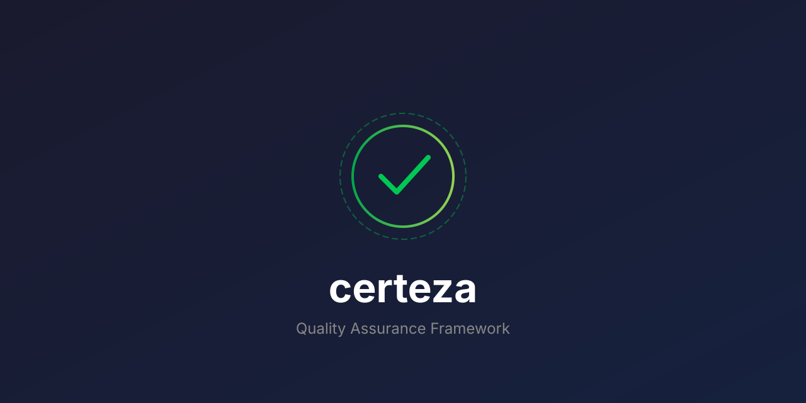

<p align="center">
  
</p>

<p align="center">
  <a href="https://crates.io/crates/aprender">
    
  </a>
  <a href="https://docs.rs/aprender">
    
  </a>
  <a href="https://github.com/paiml/aprender/actions/workflows/ci.yml">
    
  </a>
  <a href="LICENSE">
    
  </a>
</p>

## Quick Start

```bash
cargo install aprender
apr pull qwen2.5-coder-1.5b
apr run qwen2.5-coder-1.5b "What is 2+2?"
```

> **v0.34.0 — MODEL-2 §88 stack-existence-proof shipped end-to-end.**
> [`paiml/albor-370m-v1`](https://huggingface.co/paiml/albor-370m-v1) is the
> first model trained with the pure-Rust Sovereign AI Stack and published
> to HuggingFace Hub with all three usage paths verified: `apr run` (Rust),
> `AutoModelForCausalLM.from_pretrained` (HF Transformers), and `llama-cli`
> (llama.cpp). The publish workflow is now codified in
> [SPEC-HF-PUBLISH-001](docs/specifications/aprender-train/model-hf-publish-pipeline-spec.md)
> so future model publishes follow a repeatable 12-file integration plus a
> 13-tier crates.io cascade (see `scripts/cascade-publish.sh`). See the
> [v0.34.0 release notes](https://github.com/paiml/aprender/releases/tag/v0.34.0)
> for the PMAT-690 P3-C-prep defect cascade that motivated the spec.
>
> **v0.33.0 — MODEL-1 SHIP % = 100%.** SHIP-007 (GPU dispatch on the
> canonical 7B Q4K teacher) was LIVE-DISCHARGED. See the
> [v0.33.0 release notes](https://github.com/paiml/aprender/releases/tag/v0.33.0)
> and SPEC-SHIP-TWO-001 §65–§75 for the cascade detail.

## What is Aprender?

A complete ML framework in pure Rust. One `cargo install`, one `apr` binary,
the full model lifecycle — inference, training, quantization, profiling,
publishing — all backed by YAML provable contracts that fail CI on drift.

### At HEAD

| Metric | Count | Source of truth |
|-------:|------:|---|
| Workspace crates | **80** workspace crates | `ls crates/` |
| Provable contracts | **1151** provable contracts | `find contracts/ -name '*.yaml'` |
| CLI commands | **103** CLI commands | `apr --help` |

These numbers are enforced by [`contracts/readme-claims-v1.yaml`](contracts/readme-claims-v1.yaml).
Drift between this table and live repo state fails `bash scripts/check_readme_claims.sh`
→ see [FALSIFY-README-001..004](contracts/readme-claims-v1.yaml).

### Command surface

| Stage | Commands |
|---|---|
| **Inference** | `apr run`, `apr chat`, `apr serve` |
| **Training** | `apr finetune`, `apr train`, `apr pretrain`, `apr distill` |
| **Model ops** | `apr convert`, `apr quantize`, `apr merge`, `apr export`, `apr compile` |
| **Inspection** | `apr inspect`, `apr validate`, `apr tensors`, `apr diff`, `apr trace`, `apr lint` |
| **Profiling** | `apr profile`, `apr bench`, `apr qa` |
| **Registry** | `apr pull`, `apr list`, `apr rm`, `apr publish`, `apr registry` |
| **GPU** | `apr gpu`, `apr parity`, `apr ptx` |
| **Observability** | `apr tui`, `apr monitor`, `apr cbtop` |

## Cookbook

End-to-end recipes (data prep → train → quantize → publish → serve) live in
[`paiml/apr-cookbook`](https://github.com/paiml/apr-cookbook) — 341 worked
examples with local `book/src/` walkthroughs.

```bash
git clone https://github.com/paiml/apr-cookbook  # ../apr-cookbook
cd ../apr-cookbook
apr cookbook list                              # 341 recipes
apr cookbook run train-tiny-from-scratch       # runs end-to-end
```

## Install

```bash
cargo install aprender    # installs the `apr` binary
apr --version
```

## A Qwen story

Eight beats, one narrative, every core command group. Anchored on the Qwen
series so the story scales from a 494-MB safetensors model to a 30 B-parameter
MoE GGUF. Every beat is a falsifier in
[`contracts/qwen-story-v1.yaml`](contracts/qwen-story-v1.yaml); the runnable
form is [`scripts/qwen-story.sh`](scripts/qwen-story.sh); nightly cron is
[`.github/workflows/qwen-story-daily.yml`](.github/workflows/qwen-story-daily.yml);
the dogfood gate is `/dogfood` Gate 18.

```bash
# Reproduce locally (uses ~/models cache; ~3-5 min on RTX 4090):
bash scripts/qwen-story.sh
```

### Beat 1 — Discover (Registry)

```bash
apr pull hf://Qwen/Qwen2.5-Coder-0.5B-Instruct      # 494 MB safetensors
apr list                                            # confirm cached
```

### Beat 2 — Trust (QA gates)

```bash
apr qa qwen2.5-coder-1.5b-instruct-q4k              # 12 falsifiable gates
apr validate qwen2.5-coder-1.5b-instruct-q4k --quality   # 100-pt structural audit
apr lint qwen2.5-coder-1.5b-instruct-q4k            # best-practice signals
```

### Beat 3 — Explore (Inspection)

```bash
apr inspect --json qwen2.5-coder-1.5b-instruct-q4k  # arch, params, tensors
apr tensors --json qwen2.5-coder-1.5b-instruct-q4k  # 339 tensors with shapes
apr tree qwen2.5-coder-1.5b-instruct-q4k            # layer architecture
```

### Beat 4 — Adapt (Model ops)

```bash
apr export qwen2.5-coder-1.5b-instruct-q4k --format gguf -o roundtrip.gguf
apr diff qwen2.5-coder-1.5b-instruct-q4k roundtrip.gguf  # tensor-by-tensor delta
apr convert model.safetensors --quantize q4_k -o quantized.apr
```

### Beat 5 — Use (Inference)

```bash
apr run qwen2.5-coder-1.5b-instruct-q4k "fn sum(a: i32, b: i32) -> i32 {" --max-tokens 16
apr chat qwen2.5-coder-1.5b-instruct-q4k            # interactive REPL
apr code -p "review this Python function" --max-turns 1   # agent mode (PMAT-182)
```

### Beat 6 — Serve (REST API)

```bash
apr serve run qwen2.5-coder-1.5b-instruct-q4k --port 8080
curl -s localhost:8080/v1/chat/completions \
  -H 'Content-Type: application/json' \
  -d '{"model":"qwen","messages":[{"role":"user","content":"What is 2+2?"}],"max_tokens":8}'
# → {"choices":[{"message":{"content":"2 + 2 equals 4."}}],...}
```

### Beat 7 — Operate (Profiling)

```bash
apr profile qwen2.5-coder-7b-instruct-q4_k_m        # Roofline analysis
apr gpu --json                                      # VRAM, sm_*, cuda version
apr serve plan qwen2.5-coder-7b-instruct-q4_k_m     # capacity plan before run
```

### Beat 8 — Scale (MoE introspection)

```bash
apr inspect --json Qwen3-Coder-30B-A3B-Instruct     # arch=qwen3moe, 30 B params
apr tensors --json Qwen3-Coder-30B-A3B-Instruct     # 579 tensors (MoE expert layout)
```

### Publish (separate flow)

```bash
# Publish a derived model to HuggingFace Hub (see SPEC-HF-PUBLISH-001 for the 12-file pipeline)
apr stamp ckpt.apr --tokenizer /path/to/qwen-tokenizer --license Apache-2.0 -o staging/model.apr
apr export staging/model.apr --format gguf --quantize int4 -o staging/model-q4k.gguf
apr publish staging/ paiml/my-model-v1 --library-name aprender --license Apache-2.0
```

> **The bug-hunt layer.** When run with `PMAT_HUNT=1` (default), each beat
> emits a manifest of high-risk untested code in the command modules it just
> exercised:
>
> ```
> -- pmat bug-hunt manifest (run chat code) --
>     gap   crates/apr-cli/src/commands/run.rs:resolve_model_alias (impact=42.3)
>     churn crates/apr-cli/src/commands/code.rs:dispatch_agent (commits=11)
>     fault crates/aprender-serve/src/api/cuda_chat_backend.rs:try_qwen3_moe (unwrap,panic)
> ```
>
> The nightly cron opens an issue when this manifest grows, so untested
> branches in command handlers can't accumulate quietly. See
> [`contracts/qwen-story-v1.yaml`](contracts/qwen-story-v1.yaml) §
> `pmat_audit_per_beat`.

> **Publishing a model? Read [SPEC-HF-PUBLISH-001](docs/specifications/aprender-train/model-hf-publish-pipeline-spec.md).**
> It documents the 12-file minimum (.apr/.gguf/.safetensors/model.safetensors alias/config/tokenizer/LICENSE/etc.), the YAML front-matter schema, the three-path verification protocol, and the HF API gotchas (NDJSON commits, LFS batch for 5MB-5GB, empty `model-index` rejected, Q4_K K%256==0). First applied 2026-05-18 for [paiml/albor-370m-v1](https://huggingface.co/paiml/albor-370m-v1).

## Library usage

```toml
[dependencies]
aprender = "0.34"
```

```rust
use aprender::linear_regression::LinearRegression;
use aprender::traits::Estimator;

let model = LinearRegression::new();
model.fit(&x_train, &y_train)?;
let predictions = model.predict(&x_test)?;
```

Algorithms: Linear/Logistic Regression, Decision Trees, Random Forest, GBM,
Naive Bayes, KNN, SVM, K-Means, PCA, ARIMA, ICA, GLMs, graph algorithms,
Bayesian inference, text + audio processing.

## Architecture

Monorepo, flat `crates/aprender-*` layout (same pattern as
[Polars](https://github.com/pola-rs/polars),
[Burn](https://github.com/tracel-ai/burn),
[Nushell](https://github.com/nushell/nushell)):

```
paiml/aprender/
├── Cargo.toml                      # Workspace root + `cargo install aprender`
├── crates/
│   ├── aprender-core/              # ML library (use aprender::*)
│   ├── apr-cli/                    # CLI logic (103 subcommands)
│   ├── aprender-compute/           # SIMD/GPU compute kernels
│   ├── aprender-gpu/               # CUDA PTX
│   ├── aprender-serve/             # Inference server
│   ├── aprender-train/             # Training loops
│   ├── aprender-orchestrate/       # Agents + RAG
│   ├── aprender-contracts/         # Provable contracts engine
│   ├── aprender-profile/           # Profiling
│   ├── aprender-db/ aprender-graph/ aprender-rag/
│   └── ... (80 crates total)
├── contracts/                      # 1151 provable YAML contracts
└── book/                           # mdBook documentation
```

## Performance

| Model | Format | Speed | Hardware |
|-------|--------|-------|----------|
| Qwen2.5-Coder 1.5B | Q4_K | 40+ tok/s | CPU (AVX2) |
| Qwen2.5-Coder 7B | Q4_K | 225+ tok/s | RTX 4090 |
| TinyLlama 1.1B | Q4_0 | 17 tok/s | CPU (APR format) |

Reproduced from [candle-vs-apr](https://github.com/paiml/candle-vs-apr) and
[ground-truth-apr-ludwig](https://github.com/paiml/ground-truth-apr-ludwig).

## Provable contracts

Every CLI command and kernel is bound to a YAML contract with equations,
preconditions, postconditions, and falsification tests:

```yaml
equations:
  validate_exit_code:
    formula: exit_code = if score < 50 then 5 else 0
    invariants:
    - score < 50 implies exit_code != 0
falsification_tests:
- id: FALSIFY-CLI-001
  prediction: apr validate bad-model.apr exits non-zero
```

1153 contracts across inference, training, quantization, attention, FFN,
tokenization, model formats, CLI safety — and this README itself.

## Migration from old crates

| Old | New | Status |
|-----|-----|--------|
| `trueno = "0.18"` | `aprender-compute = "0.33"` | Shim available |
| `entrenar = "0.7"` | `aprender-train = "0.33"` | Shim available |
| `realizar = "0.8"` | `aprender-serve = "0.33"` | Shim available |
| `batuta = "0.7"` | `aprender-orchestrate = "0.33"` | Shim available |

Old repositories are archived. All development happens here.

## Contributing

```bash
git clone https://github.com/paiml/aprender
cd aprender
cargo test --workspace --lib
cargo check --workspace
apr --help
bash scripts/check_readme_claims.sh    # README contract gate
```

## License

MIT
