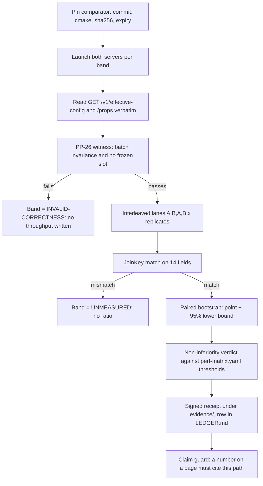

# How `apr serve` parity with llama.cpp is measured

A guide for developers on the team. It explains what the 0.65.0 release
changed about performance claims, how a parity number comes to exist, and
what you may and may not say about one. The normative text is
`docs/specifications/PP-LLAMA-001-MASTER.md` (v3.1); this page is the
narrative.

## The one-paragraph version

Parity is a same-run, same-host, per-concurrency-band comparison of
`apr serve` against a pinned `llama-server`, driven by one client binary over
one protocol, with the tokens checked for correctness before any speed is
counted. A ratio exists only when both lanes were measured in the same run and
their join keys match. A number may appear on a page only next to the receipt
that produced it. Until the first conformant receipt passes on the reference
cell, the parity gate is not armed and every parity row reads `NOT ARMED`.

## Three rules that cover almost every question

1. **Correct before fast.** The batch-invariance witness runs before any
   throughput is recorded. A band whose witness fails is
   `INVALID-CORRECTNESS`: its throughput is not written, not gated, and never a
   baseline.
2. **A ratio needs two lanes in one run.** The subject (`apr serve`) and the
   comparator (`llama-server`) are driven interleaved, A, B, A, B, by the same
   client, and joined on fourteen fields (host, model hash, workload digest,
   band, sampler, token count, window, stream mode, and more). The type that
   says "comparator measured" can only be constructed by that join.
3. **A number needs a receipt.** `scripts/check_no_claim_literals.sh` removes
   any throughput or ratio literal on a user-facing surface (README, docs,
   specs, doc comments, printed output) that does not cite a resolving
   `evidence/` path. That is why the README's throughput table was withdrawn in
   0.65.0 rather than restated.

## What is compared

| Dimension | Value |
|---|---|
| Subject | `apr serve` at a pinned commit, built with the recorded feature set |
| Comparator | `llama-server` pinned by commit, cmake flags and binary sha256, with an expiry date |
| Host | one machine per cell (`lambda` RTX 4090 is the reference cell; `gx10` GB10; `intel`) |
| Model | one file, identified by sha256 in the receipt (qwen2.5-coder-7b-instruct q4_k_m for W1) |
| Workload | W1: a fixed prompt corpus with a digest; the digest is part of the join key |
| Protocol | streaming, `temperature 0`, pinned `seed`, `ignore_eos`, exactly `n_predict` tokens per request |
| Bands | concurrency c = 1, 4, 8, 16; the comparator is launched per band with matching slots and context |
| Replicates | 5 per band by default, interleaved with a 10 s cooldown |

The comparator's own configuration is recorded verbatim from its `/props`
endpoint; the subject's from `GET /v1/effective-config`, a route added in
0.65.0 that reports the clock, compute class, build features, GPU offload,
scheduler state, kernel selection and KV settings the server is actually
running with. A receipt that cannot say what served is not a receipt.

## How the flow runs

## The statistics, briefly

Per band, each throughput measure (aggregate, decode, prefill) is reported as
the ratio subject over comparator with a point estimate and a 95% lower
confidence bound. The bound comes from a paired percentile bootstrap over the
interleaved samples with a fixed seed and 10,000 resamples, and a one-sided t
bound across replicates guards the small-n case. The verdict is
non-inferiority: the band passes only if the lower bound clears the threshold
declared for that band in `scripts/perf-matrix.yaml`, where every threshold
carries a class and an author. A pass with almost no headroom is itself
recorded as a finding, not celebrated.

## The layered gates, in the order they are asked

| Layer | Question | Runs | Ratchets |
|---|---|---|---|
| L0 correctness | were the tokens right? | nightly and at release (`scripts/check_perf041_marker.sh`) | no |
| L1 conformance | is the receipt well formed and the protocol pinned? | every merge (`scripts/perf_gate.sh`, `scripts/spec_conformance.sh`) | no |
| L2 self-regression | did this host get slower than its own last receipt? | every merge, reported | no |
| L3 parity | is the subject non-inferior to the comparator? | armed by the first PASS on the reference cell, never by date | yes, once armed |

Each band carries exactly one status: `MEASURED`, `UNMEASURED`, `NA`,
`INVALID-CORRECTNESS`, `NONCONFORMANT-VALID` or `COMPARATOR_STALE`, with a
fixed precedence. The ledger, `evidence/parity/LEDGER.md`, lists every run by
band with what it lacks.

## What the first witness taught us (0.65.0)

The first correctness witness on the reference cell returned DEFECT on every
batched band: the batched slots parted from the single-request stream at the
third token. Varying the prompt, the batch size and the kernel knobs showed
three kernel families (m=1; m=2,3; m=4,8,16), each batch-size invariant to the
end, parting from each other at the first greedy near-tie with coherent text on
both sides. The original bar had been measuring floating-point divergence
between kernel families, not batching.

PP-26 was amended, not exempted: the witness gates what invariance actually is
(every slot of a batch agrees with every other to the declared point; no slot
freezes on one token id, which is the signature of the earlier garbage-output
defect) and records the single-request agreement per band. The instrument that
would classify a near-tie flip from a real divergence, a top-2 logit margin on
the wire, is an open obligation (§12 row 22). The evidence is under
`evidence/perf041/lambda/`.

## What you may say today

- "The instrument exists and is guarded" is true.
- "The batched decode is batch-invariant on the 4090" is true under v3.1, with
  the witness marker committed.
- "apr is at parity with llama.cpp" is not yet a sentence anyone may write. The
  first conformant receipt (§12 row 18: the reference cell, both lanes, five
  replicates, one commit) has not been produced. When it exists, the ledger will
  carry it, and the claim guard will let the number through only beside it.

## Where to look

- `docs/specifications/PP-LLAMA-001-MASTER.md`: §4 estimators, §5 comparator and effective-config, §7 gates and statuses, §12 obligations, Appendix B receipt.
- `scripts/perf-matrix.yaml`: every threshold, with class and author.
- `evidence/parity/LEDGER.md`: what has actually been measured, by band.
- `apr test llm bench --band` and `scripts/parity_host_receipt.sh`: how a run is taken.
- `scripts/perf041_batched_parity_probe.sh`: the correctness witness.
- `GET /v1/effective-config`: what the server says it is running.
